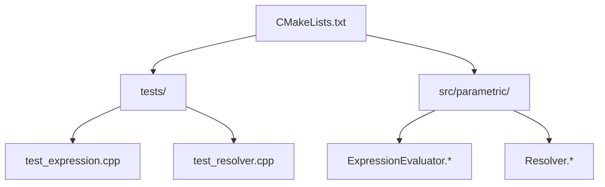
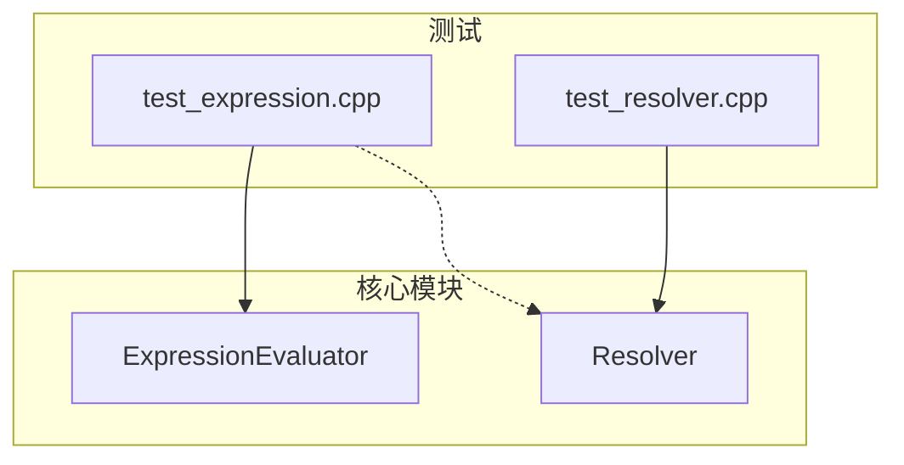
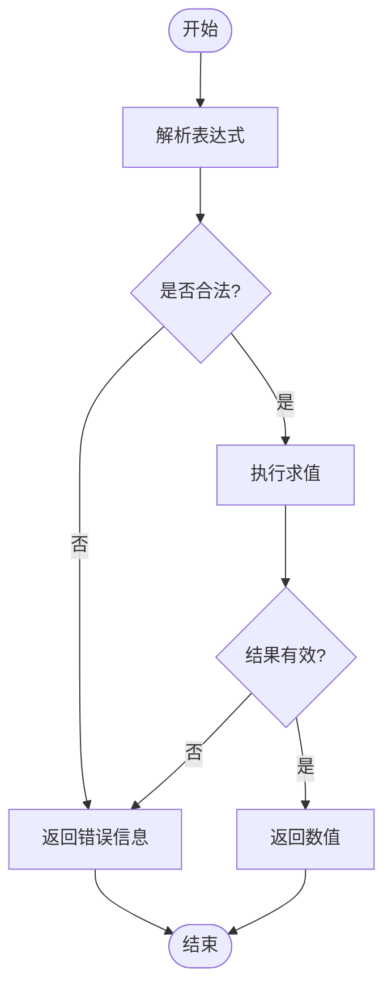
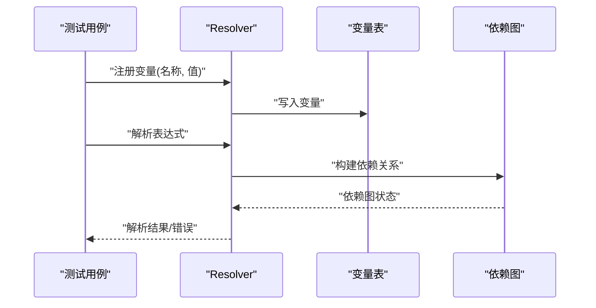
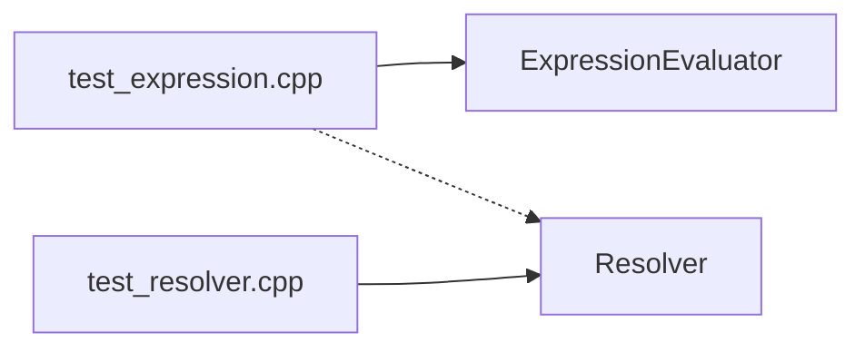

# 测试指南

<cite>
**本文档引用的文件**   
- [CMakeLists.txt](file://CMakeLists.txt)
- [CMakePresets.json](file://CMakePresets.json)
- [tests/test_expression.cpp](file://tests/test_expression.cpp)
- [tests/test_resolver.cpp](file://tests/test_resolver.cpp)
- [src/parametric/ExpressionEvaluator.h](file://src/parametric/ExpressionEvaluator.h)
- [src/parametric/ExpressionEvaluator.cpp](file://src/parametric/ExpressionEvaluator.cpp)
- [src/parametric/Resolver.h](file://src/parametric/Resolver.h)
- [src/parametric/Resolver.cpp](file://src/parametric/Resolver.cpp)
</cite>

## 目录
1. [简介](#简介)
2. [项目结构](#项目结构)
3. [核心组件](#核心组件)
4. [架构总览](#架构总览)
5. [详细组件分析](#详细组件分析)
6. [依赖分析](#依赖分析)
7. [性能考虑](#性能考虑)
8. [故障排查指南](#故障排查指南)
9. [结论](#结论)
10. [附录](#附录)

## 简介
本指南面向服装CAD项目的测试工作，聚焦于表达式求值器与解析器的单元测试实践。内容涵盖：
- 测试框架的选择与配置（基于 CMake + Google Test）
- 单元测试编写规范与用例组织
- 如何新增测试、运行套件与分析结果
- 覆盖率报告生成与持续集成建议
- 模拟对象使用与异步测试最佳实践

## 项目结构
仓库采用 CMake 构建系统，测试位于 tests 目录，业务核心在 src/parametric 下的表达式求值与解析模块。

图示来源
- [CMakeLists.txt](file://CMakeLists.txt)
- [tests/test_expression.cpp](file://tests/test_expression.cpp)
- [tests/test_resolver.cpp](file://tests/test_resolver.cpp)
- [src/parametric/ExpressionEvaluator.h](file://src/parametric/ExpressionEvaluator.h)
- [src/parametric/Resolver.h](file://src/parametric/Resolver.h)

章节来源
- [CMakeLists.txt](file://CMakeLists.txt)
- [CMakePresets.json](file://CMakePresets.json)

## 核心组件
- 表达式求值器（ExpressionEvaluator）：负责解析并计算参数化表达式，返回数值或错误信息。
- 解析器（Resolver）：负责变量解析、依赖关系处理与上下文管理。

测试目标
- 验证表达式语法正确性与求值结果
- 覆盖边界条件与异常路径
- 确保变量解析与依赖图一致性

章节来源
- [src/parametric/ExpressionEvaluator.h](file://src/parametric/ExpressionEvaluator.h)
- [src/parametric/ExpressionEvaluator.cpp](file://src/parametric/ExpressionEvaluator.cpp)
- [src/parametric/Resolver.h](file://src/parametric/Resolver.h)
- [src/parametric/Resolver.cpp](file://src/parametric/Resolver.cpp)

## 架构总览
下图展示测试与核心模块的交互关系：测试通过调用 ExpressionEvaluator 与 Resolver 的接口，驱动表达式求值与变量解析流程。

图示来源
- [tests/test_expression.cpp](file://tests/test_expression.cpp)
- [tests/test_resolver.cpp](file://tests/test_resolver.cpp)
- [src/parametric/ExpressionEvaluator.h](file://src/parametric/ExpressionEvaluator.h)
- [src/parametric/Resolver.h](file://src/parametric/Resolver.h)

## 详细组件分析

### 表达式求值器测试（ExpressionEvaluator）
- 测试要点
  - 基本算术运算、函数调用、常量与变量替换
  - 类型转换与精度控制
  - 非法表达式、除零、未定义变量等错误路径
- 推荐断言风格
  - 使用相等性断言比较浮点结果（允许误差）
  - 使用字符串匹配断言校验错误消息
- 示例用例组织
  - 按功能分组：基础运算、函数、变量、错误
  - 每个用例聚焦单一场景，避免耦合

图示来源
- [src/parametric/ExpressionEvaluator.cpp](file://src/parametric/ExpressionEvaluator.cpp)
- [tests/test_expression.cpp](file://tests/test_expression.cpp)

章节来源
- [tests/test_expression.cpp](file://tests/test_expression.cpp)
- [src/parametric/ExpressionEvaluator.h](file://src/parametric/ExpressionEvaluator.h)
- [src/parametric/ExpressionEvaluator.cpp](file://src/parametric/ExpressionEvaluator.cpp)

### 解析器测试（Resolver）
- 测试要点
  - 变量注册、查找与生命周期
  - 依赖图构建与循环依赖检测
  - 作用域隔离与变量遮蔽
- 推荐断言风格
  - 使用存在性断言检查变量是否存在
  - 使用集合断言验证依赖关系
- 示例用例组织
  - 按能力分组：注册、查找、依赖、作用域、错误

图示来源
- [src/parametric/Resolver.cpp](file://src/parametric/Resolver.cpp)
- [tests/test_resolver.cpp](file://tests/test_resolver.cpp)

章节来源
- [tests/test_resolver.cpp](file://tests/test_resolver.cpp)
- [src/parametric/Resolver.h](file://src/parametric/Resolver.h)
- [src/parametric/Resolver.cpp](file://src/parametric/Resolver.cpp)

### 新增测试用例的步骤
- 在 tests 目录下创建新文件，命名遵循 test_<模块>.cpp
- 引入必要的头文件与测试框架宏
- 为每个行为编写独立用例，保证可重复与隔离
- 使用 CMake 将新测试加入构建（见“构建与运行”）

章节来源
- [tests/test_expression.cpp](file://tests/test_expression.cpp)
- [tests/test_resolver.cpp](file://tests/test_resolver.cpp)
- [CMakeLists.txt](file://CMakeLists.txt)

### 构建与运行
- 使用 CMake 配置与编译
- 运行测试二进制以查看输出
- 结合 CMake Presets 统一开发环境

章节来源
- [CMakeLists.txt](file://CMakeLists.txt)
- [CMakePresets.json](file://CMakePresets.json)

## 依赖分析
- 测试对核心模块的依赖
  - test_expression 依赖 ExpressionEvaluator
  - test_resolver 依赖 Resolver
- 可能的间接依赖
  - 表达式求值可能依赖变量解析服务
- 建议
  - 保持测试与实现的最小必要依赖
  - 通过接口而非具体实现进行断言

图示来源
- [tests/test_expression.cpp](file://tests/test_expression.cpp)
- [tests/test_resolver.cpp](file://tests/test_resolver.cpp)
- [src/parametric/ExpressionEvaluator.h](file://src/parametric/ExpressionEvaluator.h)
- [src/parametric/Resolver.h](file://src/parametric/Resolver.h)

章节来源
- [tests/test_expression.cpp](file://tests/test_expression.cpp)
- [tests/test_resolver.cpp](file://tests/test_resolver.cpp)
- [src/parametric/ExpressionEvaluator.h](file://src/parametric/ExpressionEvaluator.h)
- [src/parametric/Resolver.h](file://src/parametric/Resolver.h)

## 性能考虑
- 测试数据规模控制：避免在单测中执行重型 IO 或复杂图形计算
- 缓存与预热：必要时在测试初始化阶段准备数据，减少重复开销
- 并行执行：启用测试并行以提升 CI 速度，注意线程安全
- 基准与回归：对关键路径添加轻量基准，防止退化

[本节为通用指导，不直接分析具体文件]

## 故障排查指南
- 常见失败原因
  - 表达式语法错误未被捕获
  - 变量未注册或作用域不正确
  - 浮点比较未设置容差导致误判
- 定位方法
  - 缩小用例范围，最小复现问题
  - 打印中间状态（如依赖图、变量表）
  - 检查错误码与消息格式
- 修复建议
  - 增加边界用例
  - 明确错误语义与返回值约定
  - 统一断言策略（含容差）

章节来源
- [tests/test_expression.cpp](file://tests/test_expression.cpp)
- [tests/test_resolver.cpp](file://tests/test_resolver.cpp)

## 结论
通过规范的测试组织与断言策略，配合 CMake 与 Google Test，可高效保障表达式求值器与解析器的质量。建议在团队内统一测试模板与最佳实践，并在 CI 中自动化执行与覆盖率统计。

[本节为总结性内容，不直接分析具体文件]

## 附录

### 测试框架选择与配置
- 框架：Google Test（gtest）
- 构建：CMake 集成，便于跨平台与 CI
- 配置要点
  - 启用 gtest 包或子模块
  - 将测试源加入 target_sources
  - 链接 gtest 库

章节来源
- [CMakeLists.txt](file://CMakeLists.txt)
- [CMakePresets.json](file://CMakePresets.json)

### 单元测试编写规范
- 命名：TEST_F/TEST_GTEST_CASE 清晰表达被测行为
- 结构：Arrange-Act-Assert 三段式
- 数据：使用参数化测试覆盖多组输入
- 稳定性：避免外部依赖与时序敏感逻辑

章节来源
- [tests/test_expression.cpp](file://tests/test_expression.cpp)
- [tests/test_resolver.cpp](file://tests/test_resolver.cpp)

### 测试用例组织结构
- 按模块划分文件：test_<module>.cpp
- 按功能分组用例：用描述性前缀或标签
- 共享夹具：抽取公共 setup/teardown

章节来源
- [tests/test_expression.cpp](file://tests/test_expression.cpp)
- [tests/test_resolver.cpp](file://tests/test_resolver.cpp)

### 覆盖率报告生成
- 工具链：gcov/lcov 或编译器内置覆盖率
- 步骤
  - 编译时开启覆盖率开关
  - 运行测试生成覆盖率数据
  - 转换为 HTML 报告
- 指标建议
  - 行覆盖率 ≥ 80%
  - 分支覆盖率 ≥ 70%

章节来源
- [CMakeLists.txt](file://CMakeLists.txt)

### 持续集成配置建议
- 触发条件：push、PR
- 任务
  - 构建与测试
  - 覆盖率收集与上传
  - 静态检查（可选）
- 缓存依赖与构建产物加速流水线

章节来源
- [CMakePresets.json](file://CMakePresets.json)

### 模拟对象的使用
- 适用场景：IO、网络、时间、随机数
- 原则
  - 仅模拟外部依赖，不模拟被测对象本身
  - 明确桩与模拟的区别
- 常用技巧
  - 期望调用次数与参数
  - 抛出异常模拟失败路径

章节来源
- [tests/test_expression.cpp](file://tests/test_expression.cpp)
- [tests/test_resolver.cpp](file://tests/test_resolver.cpp)

### 异步测试最佳实践
- 使用事件循环或回调完成机制
- 设置超时与重试策略
- 避免竞态条件：隔离资源、顺序化关键步骤

章节来源
- [tests/test_expression.cpp](file://tests/test_expression.cpp)
- [tests/test_resolver.cpp](file://tests/test_resolver.cpp)