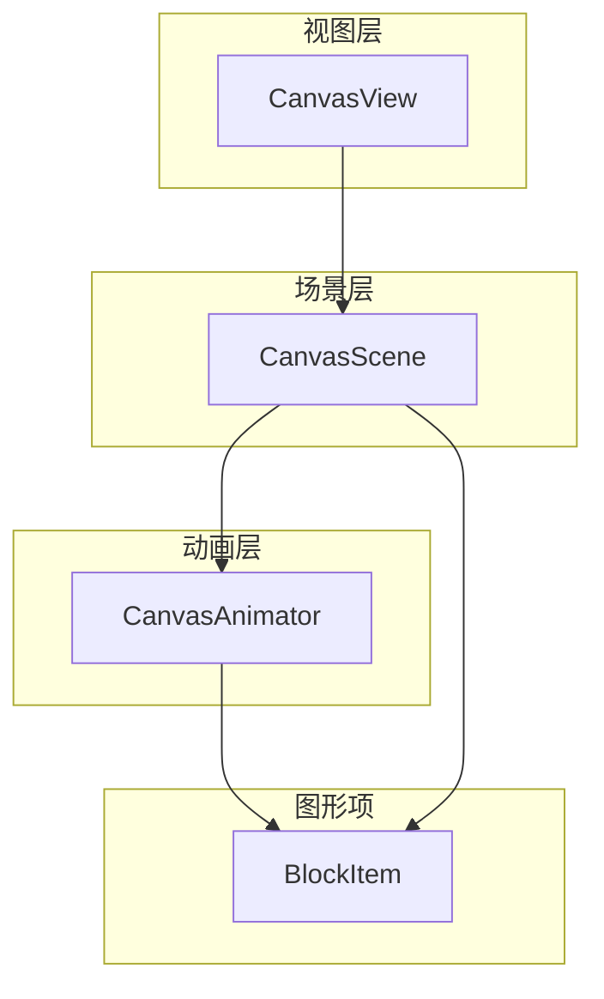
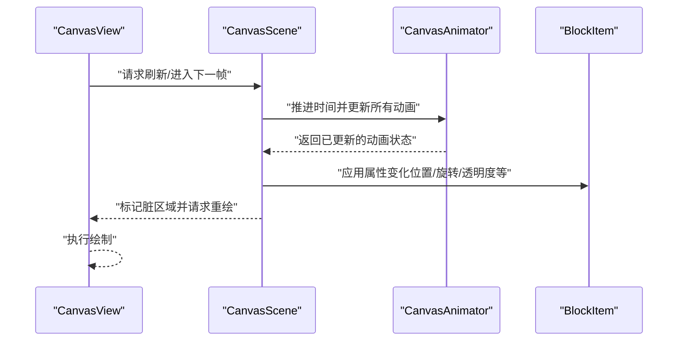
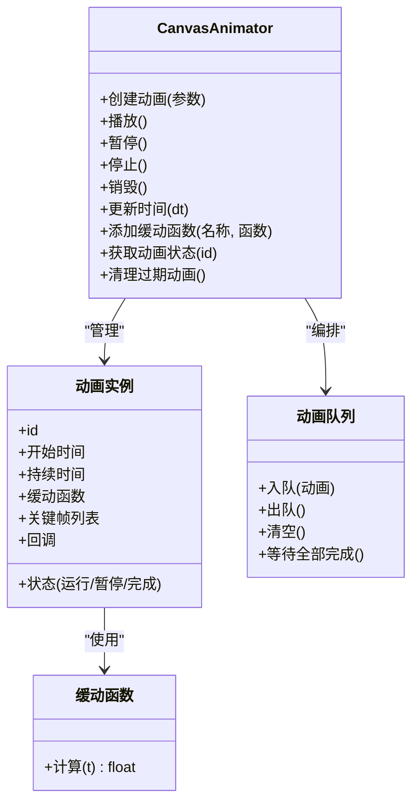
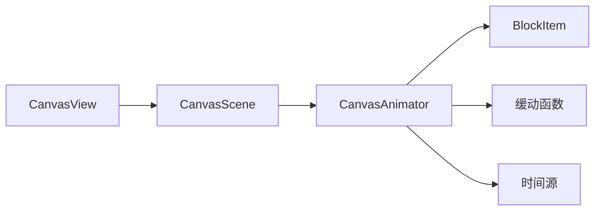
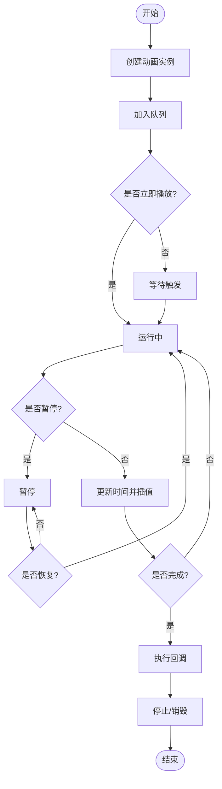

# 动画系统

<cite>
**本文引用的文件**   
- [CanvasAnimator.h](file://src/canvas/CanvasAnimator.h)
- [CanvasAnimator.cpp](file://src/canvas/CanvasAnimator.cpp)
- [CanvasScene.h](file://src/canvas/CanvasScene.h)
- [CanvasScene.cpp](file://src/canvas/CanvasScene.cpp)
- [CanvasView.h](file://src/canvas/CanvasView.h)
- [CanvasView.cpp](file://src/canvas/CanvasView.cpp)
- [BlockItem.h](file://src/canvas/BlockItem.h)
- [BlockItem.cpp](file://src/canvas/BlockItem.cpp)
</cite>

## 目录
1. [简介](#简介)
2. [项目结构](#项目结构)
3. [核心组件](#核心组件)
4. [架构总览](#架构总览)
5. [详细组件分析](#详细组件分析)
6. [依赖关系分析](#依赖关系分析)
7. [性能考虑](#性能考虑)
8. [故障排查指南](#故障排查指南)
9. [结论](#结论)
10. [附录](#附录)

## 简介
本文件为 CanvasAnimator 动画系统的技术文档，面向开发者与使用者，系统化阐述以下主题：
- 动画帧管理：关键帧、插值、时间推进与帧更新
- 缓动函数：常用曲线与自定义扩展点
- 动画队列：顺序、并行、延迟与回调链
- 时间控制机制：全局时钟、步进精度、暂停/恢复
- 生命周期：创建、播放、暂停、停止、销毁流程
- 示例实践：平滑过渡、关键帧动画、复合序列
- 性能优化与内存管理：节流、对象池、弱引用、避免抖动

## 项目结构
CanvasAnimator 位于 src/canvas 模块，与场景、视图和图形项紧密协作。核心文件包括：
- CanvasAnimator：动画引擎（帧管理、队列、时间控制、缓动）
- CanvasScene：场景层，持有并更新图形项
- CanvasView：视图层，驱动渲染循环与事件
- BlockItem：可动画的图形项基类或具体项

图表来源
- [CanvasView.h](file://src/canvas/CanvasView.h)
- [CanvasScene.h](file://src/canvas/CanvasScene.h)
- [CanvasAnimator.h](file://src/canvas/CanvasAnimator.h)
- [BlockItem.h](file://src/canvas/BlockItem.h)

章节来源
- [CanvasAnimator.h](file://src/canvas/CanvasAnimator.h)
- [CanvasScene.h](file://src/canvas/CanvasScene.h)
- [CanvasView.h](file://src/canvas/CanvasView.h)
- [BlockItem.h](file://src/canvas/BlockItem.h)

## 核心组件
- 动画引擎（CanvasAnimator）
  - 职责：维护动画实例集合、时间推进、帧更新调度、缓动计算、队列编排
  - 关键能力：创建/销毁动画、播放/暂停/停止、按时间步长更新、批量刷新
- 场景（CanvasScene）
  - 职责：管理图形项生命周期、接收动画结果并应用到项属性
  - 关键能力：注册/注销项、批量更新、脏区域标记
- 视图（CanvasView）
  - 职责：驱动渲染循环、处理用户交互、触发动画步进
  - 关键能力：定时器/刷新回调、事件分发、重绘请求
- 图形项（BlockItem）
  - 职责：承载可动画属性（位置、旋转、缩放、透明度等）
  - 关键能力：属性读写、变更通知、绘制

章节来源
- [CanvasAnimator.cpp](file://src/canvas/CanvasAnimator.cpp)
- [CanvasScene.cpp](file://src/canvas/CanvasScene.cpp)
- [CanvasView.cpp](file://src/canvas/CanvasView.cpp)
- [BlockItem.cpp](file://src/canvas/BlockItem.cpp)

## 架构总览
CanvasAnimator 采用“引擎-场景-视图”分层架构，通过时间驱动与属性绑定实现解耦。

图表来源
- [CanvasView.cpp](file://src/canvas/CanvasView.cpp)
- [CanvasScene.cpp](file://src/canvas/CanvasScene.cpp)
- [CanvasAnimator.cpp](file://src/canvas/CanvasAnimator.cpp)
- [BlockItem.cpp](file://src/canvas/BlockItem.cpp)

## 详细组件分析

### 动画引擎（CanvasAnimator）
- 帧管理
  - 关键帧定义：起止时间、目标值、插值方式
  - 帧推进：基于时间增量计算当前进度，映射到属性值
  - 批量更新：每帧遍历活跃动画，合并变更，减少重复计算
- 缓动函数
  - 内置曲线：线性、二次、三次、贝塞尔、弹性等
  - 自定义扩展：提供接口以接入第三方曲线或采样表
- 动画队列
  - 顺序队列：依次执行，支持延迟与回调
  - 并行队列：同时运行多个动画，统一结束条件
  - 优先级与抢占：高优先级动画可中断低优先级
- 时间控制
  - 全局时钟：统一时间源，支持加速/减速/暂停
  - 步进精度：固定步长或自适应步长，保证稳定性
  - 暂停/恢复：冻结时间推进，保留状态

图表来源
- [CanvasAnimator.h](file://src/canvas/CanvasAnimator.h)
- [CanvasAnimator.cpp](file://src/canvas/CanvasAnimator.cpp)

章节来源
- [CanvasAnimator.h](file://src/canvas/CanvasAnimator.h)
- [CanvasAnimator.cpp](file://src/canvas/CanvasAnimator.cpp)

### 场景（CanvasScene）
- 职责：将动画结果应用到图形项属性，协调脏区域与重绘
- 关键点：
  - 注册项：允许项参与动画
  - 批量更新：收集变更，最小化重绘范围
  - 事件桥接：响应动画完成事件，触发后续逻辑

章节来源
- [CanvasScene.h](file://src/canvas/CanvasScene.h)
- [CanvasScene.cpp](file://src/canvas/CanvasScene.cpp)

### 视图（CanvasView）
- 职责：驱动渲染循环，处理用户输入，触发动画步进
- 关键点：
  - 定时器/刷新回调：确保稳定帧率
  - 事件分发：点击、拖拽等影响动画状态
  - 重绘请求：按需更新，避免全量绘制

章节来源
- [CanvasView.h](file://src/canvas/CanvasView.h)
- [CanvasView.cpp](file://src/canvas/CanvasView.cpp)

### 图形项（BlockItem）
- 职责：承载可动画属性，提供读写接口与变更通知
- 关键点：
  - 属性类型：位置、旋转、缩放、透明度、颜色等
  - 变更通知：当属性变化时通知场景进行局部重绘
  - 绘制优化：缓存、裁剪、增量更新

章节来源
- [BlockItem.h](file://src/canvas/BlockItem.h)
- [BlockItem.cpp](file://src/canvas/BlockItem.cpp)

## 依赖关系分析
- CanvasAnimator 依赖缓动函数库与时间源
- CanvasScene 依赖 CanvasAnimator 的结果并作用于 BlockItem
- CanvasView 驱动整体循环，间接依赖 CanvasScene 与 CanvasAnimator
- BlockItem 被 CanvasScene 与 CanvasAnimator 共同作用

图表来源
- [CanvasView.h](file://src/canvas/CanvasView.h)
- [CanvasScene.h](file://src/canvas/CanvasScene.h)
- [CanvasAnimator.h](file://src/canvas/CanvasAnimator.h)
- [BlockItem.h](file://src/canvas/BlockItem.h)

章节来源
- [CanvasView.cpp](file://src/canvas/CanvasView.cpp)
- [CanvasScene.cpp](file://src/canvas/CanvasScene.cpp)
- [CanvasAnimator.cpp](file://src/canvas/CanvasAnimator.cpp)
- [BlockItem.cpp](file://src/canvas/BlockItem.cpp)

## 性能考虑
- 帧更新策略
  - 固定步长：保证数值稳定性，适合物理与动画
  - 自适应步长：根据设备性能动态调整
- 批量更新与脏区域
  - 合并属性变更，减少重绘次数
  - 仅更新受影响区域，降低绘制开销
- 对象池与复用
  - 重用动画实例与中间对象，避免频繁分配
- 弱引用与生命周期
  - 使用弱引用避免循环引用与悬挂指针
- 缓动计算优化
  - 预计算采样表或分段近似
  - 避免在热路径中进行复杂运算
- 渲染优化
  - 启用硬件加速（如可用）
  - 合理设置抗锯齿与混合模式

[本节为通用指导，不直接分析具体文件]

## 故障排查指南
- 常见问题
  - 动画卡顿：检查帧率与步长设置，确认无阻塞操作
  - 属性未更新：确认项已注册且属性写入正确
  - 内存泄漏：检查对象生命周期与引用计数
  - 时序错乱：验证时间源一致性与暂停/恢复逻辑
- 调试建议
  - 输出动画状态与时间戳
  - 可视化关键帧与缓动曲线
  - 使用性能分析工具定位热点

章节来源
- [CanvasAnimator.cpp](file://src/canvas/CanvasAnimator.cpp)
- [CanvasScene.cpp](file://src/canvas/CanvasScene.cpp)
- [CanvasView.cpp](file://src/canvas/CanvasView.cpp)
- [BlockItem.cpp](file://src/canvas/BlockItem.cpp)

## 结论
CanvasAnimator 通过清晰的层次结构与稳定的时间驱动，实现了高效、可扩展的动画系统。借助缓动函数、队列编排与精细的时间控制，能够支撑从简单过渡到复杂序列的多类动画需求。结合性能优化与内存管理策略，可在资源受限环境下保持流畅体验。

[本节为总结性内容，不直接分析具体文件]

## 附录

### 动画生命周期流程图

[本图为概念性流程图，不直接映射具体文件]

### 示例实践要点
- 平滑过渡效果
  - 使用缓动函数对属性进行非线性插值
  - 合理设置持续时间与步长
- 关键帧动画
  - 定义多段关键帧，逐段插值
  - 注意衔接处的连续性与导数连续性
- 复合动画序列
  - 顺序队列：串联多个动画
  - 并行队列：组合位移与旋转
  - 回调链：在节点处触发业务逻辑

[本节为概念性说明，不直接分析具体文件]