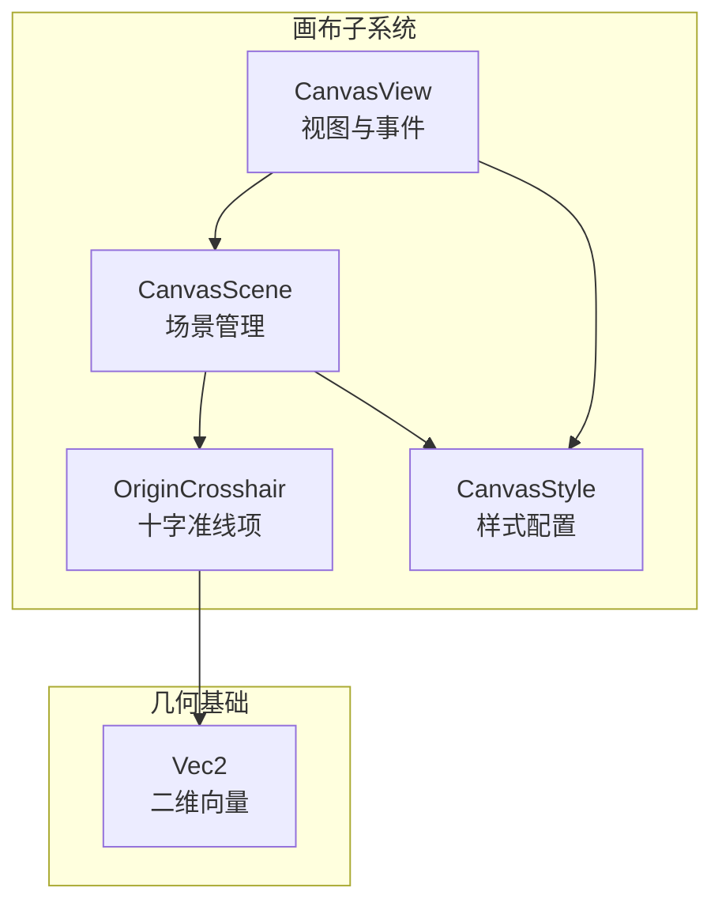
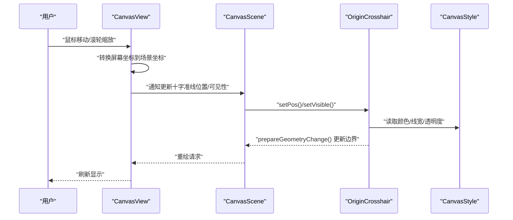
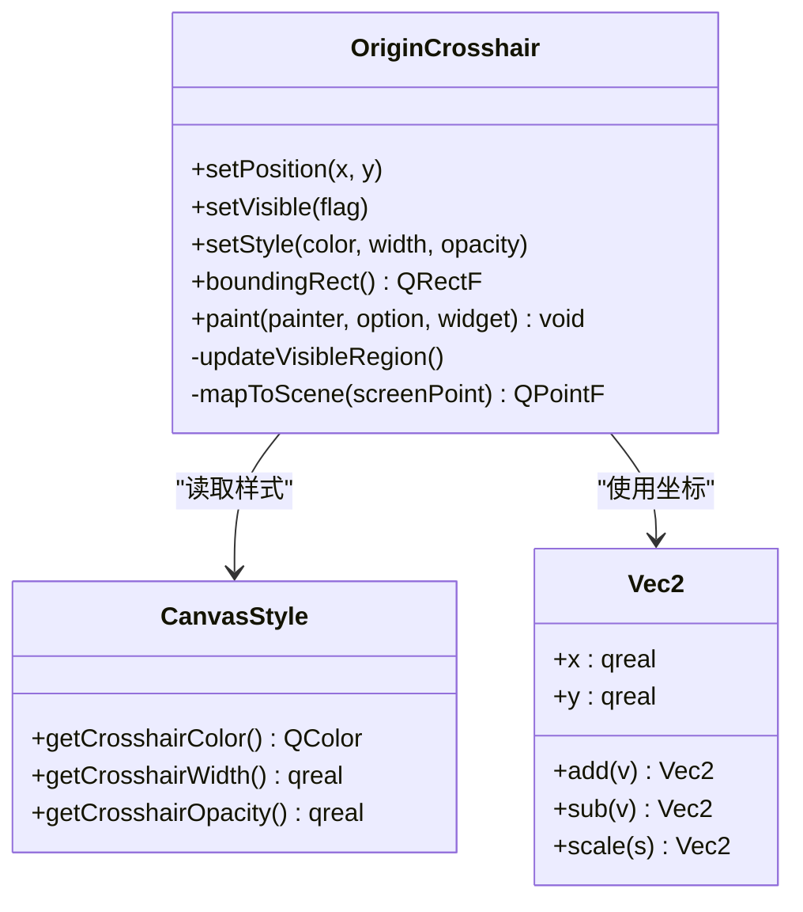
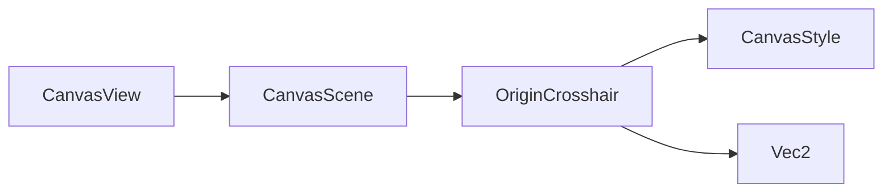

# 十字准线

<cite>
**本文引用的文件**   
- [OriginCrosshair.h](file://src/canvas/OriginCrosshair.h)
- [OriginCrosshair.cpp](file://src/canvas/OriginCrosshair.cpp)
- [CanvasScene.h](file://src/canvas/CanvasScene.h)
- [CanvasScene.cpp](file://src/canvas/CanvasScene.cpp)
- [CanvasView.h](file://src/canvas/CanvasView.h)
- [CanvasView.cpp](file://src/canvas/CanvasView.cpp)
- [CanvasStyle.h](file://src/canvas/CanvasStyle.h)
- [CanvasStyle.cpp](file://src/canvas/CanvasStyle.cpp)
- [Vec2.h](file://src/geometry/Vec2.h)
</cite>

## 目录
1. [简介](#简介)
2. [项目结构](#项目结构)
3. [核心组件](#核心组件)
4. [架构总览](#架构总览)
5. [详细组件分析](#详细组件分析)
6. [依赖关系分析](#依赖关系分析)
7. [性能考虑](#性能考虑)
8. [故障排查指南](#故障排查指南)
9. [结论](#结论)
10. [附录](#附录)

## 简介
本文件为 OriginCrosshair 十字准线组件的技术文档，聚焦以下方面：
- 绘制算法与可见性控制
- 坐标定位与画布坐标系统映射
- 样式配置与动态更新机制
- 与其他元素的交互方式
- 不同缩放级别下的显示策略
- 性能优化建议

该组件用于在 Canvas 场景中提供一条或多条参考十字线，辅助用户精确定位与对齐。其实现基于 Qt Graphics View 框架，通过自定义图形项完成绘制与交互。

## 项目结构
与十字准线相关的代码主要位于 canvas 子模块中，涉及场景、视图、样式以及几何类型定义。下图概述了关键文件之间的职责与关系。

图表来源
- [CanvasScene.h](file://src/canvas/CanvasScene.h)
- [CanvasView.h](file://src/canvas/CanvasView.h)
- [CanvasStyle.h](file://src/canvas/CanvasStyle.h)
- [OriginCrosshair.h](file://src/canvas/OriginCrosshair.h)
- [Vec2.h](file://src/geometry/Vec2.h)

章节来源
- [CanvasScene.h](file://src/canvas/CanvasScene.h)
- [CanvasView.h](file://src/canvas/CanvasView.h)
- [CanvasStyle.h](file://src/canvas/CanvasStyle.h)
- [OriginCrosshair.h](file://src/canvas/OriginCrosshair.h)
- [Vec2.h](file://src/geometry/Vec2.h)

## 核心组件
- OriginCrosshair：自定义 QGraphicsItem，负责十字线的绘制、命中测试、可见性与样式。
- CanvasScene：管理场景中的图形项，维护十字准线实例的添加、移除与更新。
- CanvasView：处理鼠标事件（移动、滚轮等），驱动十字准线位置与可见性的动态更新。
- CanvasStyle：集中管理颜色、线宽、透明度等视觉属性，供十字准线读取。
- Vec2：二维向量类型，用于表示坐标与方向。

章节来源
- [OriginCrosshair.h](file://src/canvas/OriginCrosshair.h)
- [OriginCrosshair.cpp](file://src/canvas/OriginCrosshair.cpp)
- [CanvasScene.h](file://src/canvas/CanvasScene.h)
- [CanvasScene.cpp](file://src/canvas/CanvasScene.cpp)
- [CanvasView.h](file://src/canvas/CanvasView.h)
- [CanvasView.cpp](file://src/canvas/CanvasView.cpp)
- [CanvasStyle.h](file://src/canvas/CanvasStyle.h)
- [CanvasStyle.cpp](file://src/canvas/CanvasStyle.cpp)
- [Vec2.h](file://src/geometry/Vec2.h)

## 架构总览
十字准线的工作流由视图事件触发，经场景协调，最终由十字准线项完成绘制。下图展示了典型的数据与控制流。

图表来源
- [CanvasView.cpp](file://src/canvas/CanvasView.cpp)
- [CanvasScene.cpp](file://src/canvas/CanvasScene.cpp)
- [OriginCrosshair.cpp](file://src/canvas/OriginCrosshair.cpp)
- [CanvasStyle.cpp](file://src/canvas/CanvasStyle.cpp)

## 详细组件分析

### OriginCrosshair 十字准线项
- 职责
  - 绘制水平与垂直两条参考线，覆盖可视区域或指定范围。
  - 根据当前缩放级别调整线宽与透明度，保证在不同级别下清晰可见。
  - 提供命中测试，支持鼠标悬停高亮或交互反馈。
  - 暴露样式接口，允许外部设置颜色、线型、透明度等。
- 坐标与绘制
  - 使用场景坐标进行绘制，避免受视图变换影响导致的错位。
  - 根据当前可见矩形计算线段端点，确保仅绘制可视范围内的部分。
  - 当缩放变化时，重新计算边界并触发 prepareGeometryChange。
- 可见性控制
  - 根据视图是否包含十字准线位置决定 setVisible。
  - 支持按层级或条件隐藏（例如被其他元素遮挡时）。
- 样式配置
  - 从 CanvasStyle 读取默认样式，也可局部覆盖。
  - 支持虚线、实线、点划线等线型切换。
- 性能优化
  - 仅在位置或样式变化时更新边界与重绘。
  - 使用最小包围盒减少不必要的重绘区域。

图表来源
- [OriginCrosshair.h](file://src/canvas/OriginCrosshair.h)
- [OriginCrosshair.cpp](file://src/canvas/OriginCrosshair.cpp)
- [CanvasStyle.h](file://src/canvas/CanvasStyle.h)
- [Vec2.h](file://src/geometry/Vec2.h)

章节来源
- [OriginCrosshair.h](file://src/canvas/OriginCrosshair.h)
- [OriginCrosshair.cpp](file://src/canvas/OriginCrosshair.cpp)
- [CanvasStyle.h](file://src/canvas/CanvasStyle.h)
- [CanvasStyle.cpp](file://src/canvas/CanvasStyle.cpp)
- [Vec2.h](file://src/geometry/Vec2.h)

### CanvasScene 场景管理
- 职责
  - 管理 OriginCrosshair 实例的生命周期（创建、添加、删除）。
  - 响应视图缩放与平移，驱动十字准线位置与可见性更新。
  - 协调样式变更，使十字准线实时反映最新样式。
- 关键流程
  - 视图发送更新信号后，场景计算十字准线应处的场景坐标。
  - 调用十字准线项的 setPosition 与 setVisible。
  - 必要时触发 prepareGeometryChange 以更新渲染边界。

章节来源
- [CanvasScene.h](file://src/canvas/CanvasScene.h)
- [CanvasScene.cpp](file://src/canvas/CanvasScene.cpp)

### CanvasView 视图与事件
- 职责
  - 捕获鼠标移动、滚轮缩放等事件。
  - 将屏幕坐标转换为场景坐标，传递给场景进行更新。
  - 根据缩放级别决定是否显示十字准线（例如极小缩放时隐藏）。
- 交互细节
  - 鼠标移动时实时更新十字准线位置。
  - 滚轮缩放时调整十字准线样式（线宽、透明度）以保持可读性。

章节来源
- [CanvasView.h](file://src/canvas/CanvasView.h)
- [CanvasView.cpp](file://src/canvas/CanvasView.cpp)

### CanvasStyle 样式配置
- 职责
  - 集中管理十字准线的颜色、线宽、透明度、线型等属性。
  - 提供默认值与可覆盖的配置接口。
- 使用方式
  - 十字准线项在绘制前读取样式，确保一致的外观。
  - 支持运行时修改样式并立即生效。

章节来源
- [CanvasStyle.h](file://src/canvas/CanvasStyle.h)
- [CanvasStyle.cpp](file://src/canvas/CanvasStyle.cpp)

### Vec2 几何类型
- 职责
  - 提供二维向量的基本运算（加减、缩放等）。
  - 作为坐标与方向的通用表示，简化数学计算。

章节来源
- [Vec2.h](file://src/geometry/Vec2.h)

## 依赖关系分析
十字准线组件依赖场景、视图与样式模块，同时使用几何类型进行坐标计算。下图展示依赖关系。

图表来源
- [CanvasView.h](file://src/canvas/CanvasView.h)
- [CanvasScene.h](file://src/canvas/CanvasScene.h)
- [OriginCrosshair.h](file://src/canvas/OriginCrosshair.h)
- [CanvasStyle.h](file://src/canvas/CanvasStyle.h)
- [Vec2.h](file://src/geometry/Vec2.h)

章节来源
- [CanvasView.h](file://src/canvas/CanvasView.h)
- [CanvasScene.h](file://src/canvas/CanvasScene.h)
- [OriginCrosshair.h](file://src/canvas/OriginCrosshair.h)
- [CanvasStyle.h](file://src/canvas/CanvasStyle.h)
- [Vec2.h](file://src/geometry/Vec2.h)

## 性能考虑
- 增量更新
  - 仅在位置或样式变化时调用 prepareGeometryChange，避免全量重绘。
- 可见区域裁剪
  - 根据当前可见矩形计算线段端点，减少无效绘制。
- 缩放自适应
  - 根据缩放级别动态调整线宽与透明度，保持清晰度同时降低渲染压力。
- 事件节流
  - 在高频率鼠标事件中合并更新，避免频繁调用场景更新。
- 内存与对象复用
  - 重用十字准线实例，避免频繁创建销毁。

[本节为通用性能指导，不直接分析具体文件]

## 故障排查指南
- 十字准线不显示
  - 检查可见性标志是否被设置为 false。
  - 确认十字准线位置是否在视图可见区域内。
  - 验证样式颜色与背景对比度是否足够。
- 位置偏移
  - 核对屏幕坐标到场景坐标的转换逻辑。
  - 检查视图变换（缩放、平移）是否正确应用。
- 样式未生效
  - 确认 CanvasStyle 的读取路径是否被调用。
  - 检查是否存在局部覆盖导致样式不一致。
- 性能问题
  - 观察是否有高频无意义的更新调用。
  - 评估可见区域裁剪是否有效。

章节来源
- [OriginCrosshair.cpp](file://src/canvas/OriginCrosshair.cpp)
- [CanvasScene.cpp](file://src/canvas/CanvasScene.cpp)
- [CanvasView.cpp](file://src/canvas/CanvasView.cpp)
- [CanvasStyle.cpp](file://src/canvas/CanvasStyle.cpp)

## 结论
OriginCrosshair 组件通过清晰的职责划分与良好的依赖关系，实现了稳定高效的十字准线功能。其在坐标映射、可见性控制、样式配置与动态更新方面具备完善的实现，并提供了针对缩放级别的显示策略与性能优化手段。开发者可通过 CanvasStyle 与场景/视图接口灵活定制行为与外观。

[本节为总结性内容，不直接分析具体文件]

## 附录
- 自定义示例要点
  - 修改样式：通过 CanvasStyle 设置颜色、线宽、透明度与线型。
  - 调整显示行为：在 CanvasView 中根据事件阈值决定是否显示。
  - 与其他元素交互：在 CanvasScene 中监听碰撞或重叠事件，改变十字准线优先级。
- 缩放级别显示策略
  - 大缩放：增加线宽与不透明度，突出参考线。
  - 小缩放：降低线宽与不透明度，避免干扰主内容。
  - 中等缩放：平衡清晰度与性能，采用默认样式。

[本节为概念性说明，不直接分析具体文件]