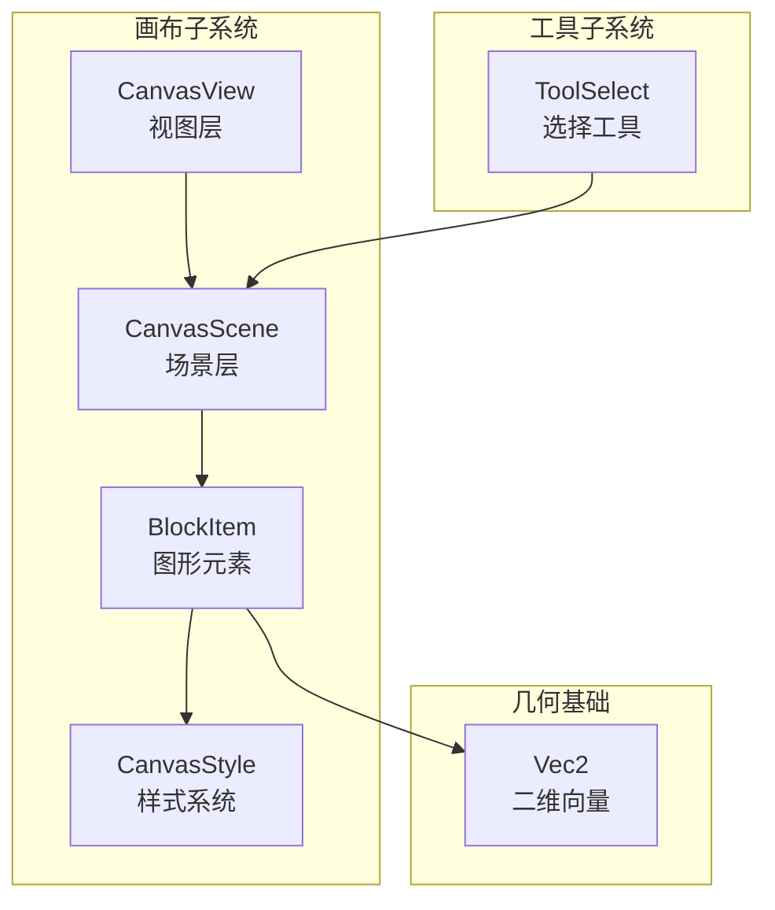
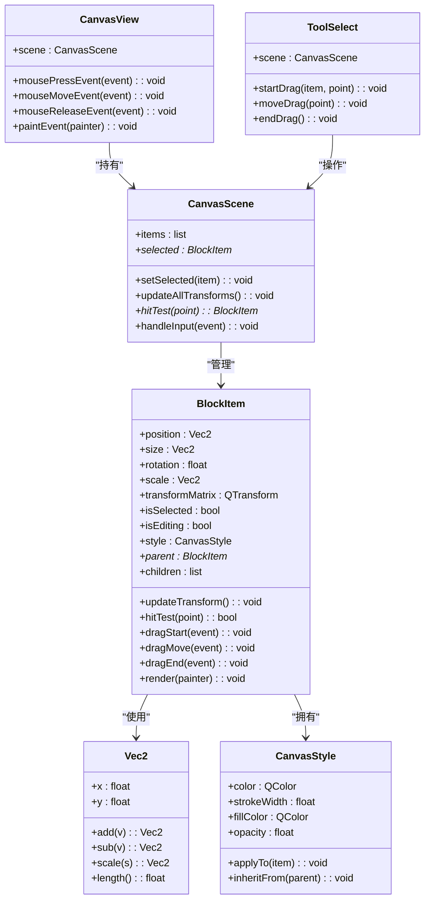
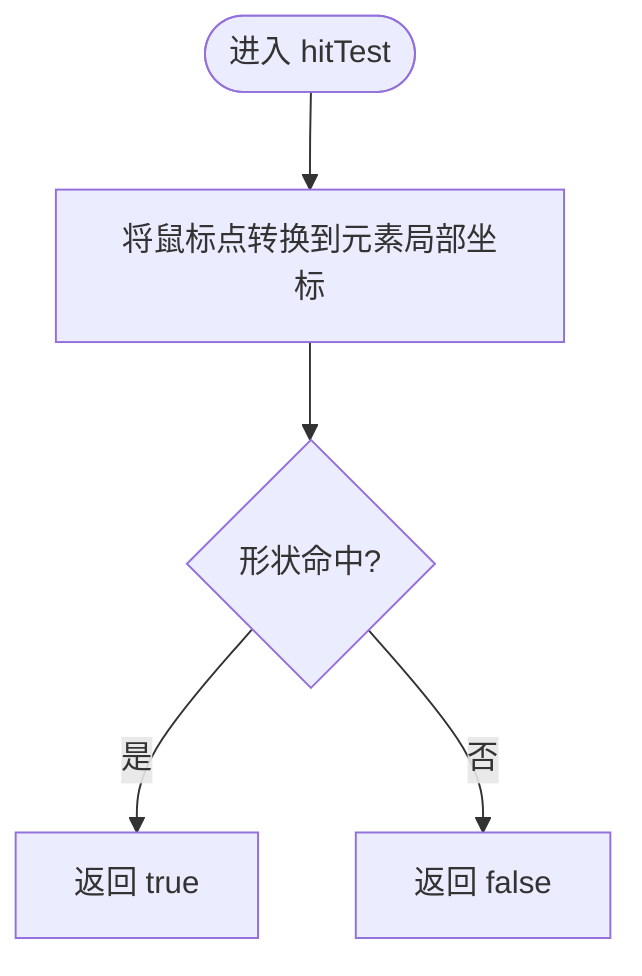
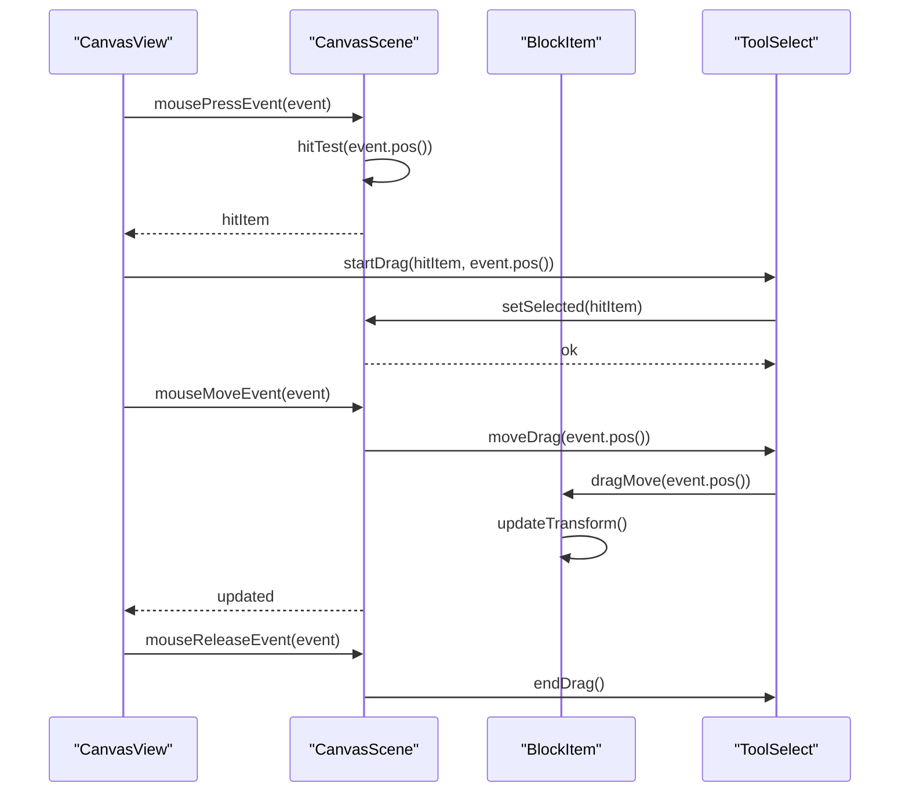
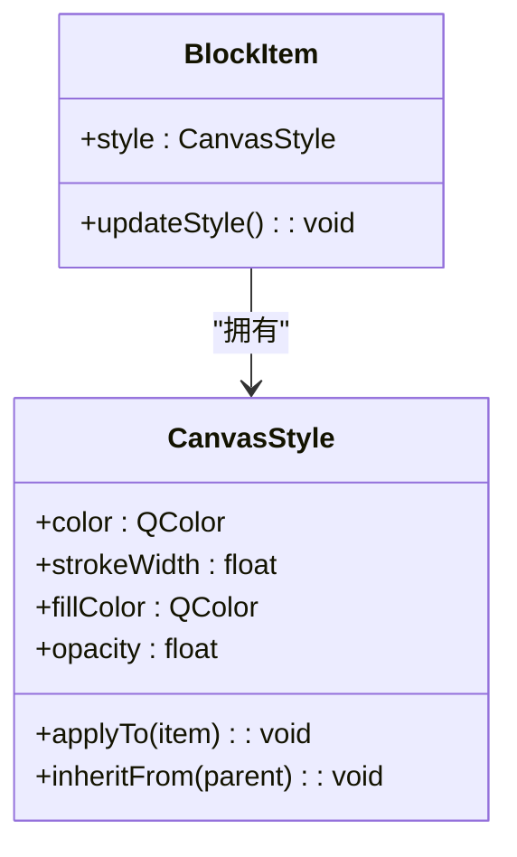
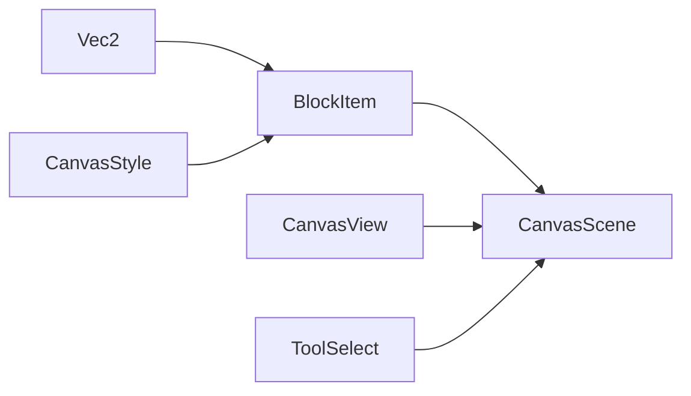

# 图形元素

<cite>
**本文引用的文件**   
- [BlockItem.h](file://src/canvas/BlockItem.h)
- [BlockItem.cpp](file://src/canvas/BlockItem.cpp)
- [CanvasScene.h](file://src/canvas/CanvasScene.h)
- [CanvasScene.cpp](file://src/canvas/CanvasScene.cpp)
- [CanvasStyle.h](file://src/canvas/CanvasStyle.h)
- [CanvasStyle.cpp](file://src/canvas/CanvasStyle.cpp)
- [CanvasView.h](file://src/canvas/CanvasView.h)
- [CanvasView.cpp](file://src/canvas/CanvasView.cpp)
- [ToolSelect.h](file://src/tools/ToolSelect.h)
- [ToolSelect.cpp](file://src/tools/ToolSelect.cpp)
- [Vec2.h](file://src/geometry/Vec2.h)
</cite>

## 目录
1. [简介](#简介)
2. [项目结构](#项目结构)
3. [核心组件](#核心组件)
4. [架构总览](#架构总览)
5. [详细组件分析](#详细组件分析)
6. [依赖关系分析](#依赖关系分析)
7. [性能考虑](#性能考虑)
8. [故障排查指南](#故障排查指南)
9. [结论](#结论)
10. [附录](#附录)

## 简介
本文件围绕 BlockItem 图形元素组件，系统性阐述其基类设计、属性系统、样式继承、变换矩阵应用、选中状态与编辑模式、拖拽行为与碰撞检测，以及元素层次结构与父子关系维护。文档同时提供创建自定义图形元素、设置样式属性、处理用户交互的具体示例路径，帮助读者快速上手并深入理解该子系统的设计与实现。

## 项目结构
与 BlockItem 相关的代码主要分布在 canvas 与 tools 子系统中：
- canvas：负责图形场景、视图渲染、元素绘制与交互、样式管理
- tools：负责工具（如选择工具）与用户输入处理
- geometry：基础几何类型（如二维向量）

图表来源
- [CanvasView.h](file://src/canvas/CanvasView.h)
- [CanvasScene.h](file://src/canvas/CanvasScene.h)
- [BlockItem.h](file://src/canvas/BlockItem.h)
- [CanvasStyle.h](file://src/canvas/CanvasStyle.h)
- [ToolSelect.h](file://src/tools/ToolSelect.h)
- [Vec2.h](file://src/geometry/Vec2.h)

章节来源
- [CanvasView.h](file://src/canvas/CanvasView.h)
- [CanvasScene.h](file://src/canvas/CanvasScene.h)
- [BlockItem.h](file://src/canvas/BlockItem.h)
- [CanvasStyle.h](file://src/canvas/CanvasStyle.h)
- [ToolSelect.h](file://src/tools/ToolSelect.h)
- [Vec2.h](file://src/geometry/Vec2.h)

## 核心组件
- BlockItem：图形元素的抽象与具体实现，承载位置、尺寸、旋转、缩放等变换信息，提供绘制接口、命中测试、选中与编辑状态、拖拽支持等能力。
- CanvasScene：管理所有 BlockItem 实例的集合、层级关系、坐标变换、事件分发、碰撞检测与布局更新。
- CanvasStyle：定义元素的视觉样式（颜色、描边、填充、透明度等），并提供样式继承与覆盖机制。
- CanvasView：将 CanvasScene 中的元素渲染到屏幕，处理鼠标/键盘事件转发至场景与工具。
- ToolSelect：选择工具，负责选中、移动、缩放、旋转等编辑操作。
- Vec2：二维向量，用于表示位置、位移、尺寸等几何数据。

章节来源
- [BlockItem.h](file://src/canvas/BlockItem.h)
- [BlockItem.cpp](file://src/canvas/BlockItem.cpp)
- [CanvasScene.h](file://src/canvas/CanvasScene.h)
- [CanvasScene.cpp](file://src/canvas/CanvasScene.cpp)
- [CanvasStyle.h](file://src/canvas/CanvasStyle.h)
- [CanvasStyle.cpp](file://src/canvas/CanvasStyle.cpp)
- [CanvasView.h](file://src/canvas/CanvasView.h)
- [CanvasView.cpp](file://src/canvas/CanvasView.cpp)
- [ToolSelect.h](file://src/tools/ToolSelect.h)
- [ToolSelect.cpp](file://src/tools/ToolSelect.cpp)
- [Vec2.h](file://src/geometry/Vec2.h)

## 架构总览
BlockItem 作为图形元素的核心，通过 CanvasScene 进行生命周期管理与事件调度；CanvasStyle 为元素提供统一的样式体系；CanvasView 负责渲染与输入转发；ToolSelect 在选中状态下驱动编辑行为。整体采用分层架构：视图层（CanvasView）、场景层（CanvasScene）、元素层（BlockItem）、样式层（CanvasStyle）。

图表来源
- [BlockItem.h](file://src/canvas/BlockItem.h)
- [BlockItem.cpp](file://src/canvas/BlockItem.cpp)
- [CanvasScene.h](file://src/canvas/CanvasScene.h)
- [CanvasScene.cpp](file://src/canvas/CanvasScene.cpp)
- [CanvasStyle.h](file://src/canvas/CanvasStyle.h)
- [CanvasStyle.cpp](file://src/canvas/CanvasStyle.cpp)
- [CanvasView.h](file://src/canvas/CanvasView.h)
- [CanvasView.cpp](file://src/canvas/CanvasView.cpp)
- [ToolSelect.h](file://src/tools/ToolSelect.h)
- [ToolSelect.cpp](file://src/tools/ToolSelect.cpp)
- [Vec2.h](file://src/geometry/Vec2.h)

## 详细组件分析

### BlockItem：图形元素基类与实现
- 基类设计
  - 统一的位置、尺寸、旋转、缩放等变换属性，内部维护变换矩阵以加速绘制与命中测试。
  - 父子关系：支持 parent/children 指针，便于层次化组织与变换传播。
  - 样式系统：每个元素持有 CanvasStyle，支持从父元素继承样式并在自身覆盖。
- 属性系统
  - 位置与尺寸：基于 Vec2 表示，提供加减缩放等操作。
  - 旋转与缩放：角度与比例因子，结合变换矩阵计算最终绘制坐标。
  - 选中与编辑状态：isSelected 控制高亮显示，isEditing 控制编辑手柄与交互行为。
- 变换矩阵应用
  - updateTransform 根据 position、size、rotation、scale 构建 QTransform，供 render 与 hitTest 使用。
- 选中状态与编辑模式
  - 选中时绘制边框或手柄；编辑模式下允许拖拽调整尺寸或旋转。
- 拖拽行为
  - dragStart/dragMove/dragEnd 三阶段处理，记录初始点与增量，实时更新位置或尺寸。
- 碰撞检测
  - hitTest 基于当前变换矩阵将鼠标点转换到元素局部坐标系，再进行几何判断（矩形/多边形等）。

图表来源
- [BlockItem.cpp](file://src/canvas/BlockItem.cpp)

章节来源
- [BlockItem.h](file://src/canvas/BlockItem.h)
- [BlockItem.cpp](file://src/canvas/BlockItem.cpp)

### CanvasScene：场景管理与事件分发
- 元素集合与层级
  - 维护 items 列表与父子关系，支持添加、移除、查找元素。
- 选中状态管理
  - setSelected 更新 selected 指针，触发重绘与工具同步。
- 变换更新
  - updateAllTransforms 遍历所有元素调用 updateTransform，确保绘制一致性。
- 事件分发与碰撞检测
  - handleInput 接收来自 CanvasView 的事件，按优先级进行命中测试与转发给对应工具。
  - hitTest 自顶向下遍历元素树，返回最上层命中元素。

图表来源
- [CanvasScene.h](file://src/canvas/CanvasScene.h)
- [CanvasScene.cpp](file://src/canvas/CanvasScene.cpp)
- [CanvasView.h](file://src/canvas/CanvasView.h)
- [CanvasView.cpp](file://src/canvas/CanvasView.cpp)
- [ToolSelect.h](file://src/tools/ToolSelect.h)
- [ToolSelect.cpp](file://src/tools/ToolSelect.cpp)
- [BlockItem.h](file://src/canvas/BlockItem.h)
- [BlockItem.cpp](file://src/canvas/BlockItem.cpp)

章节来源
- [CanvasScene.h](file://src/canvas/CanvasScene.h)
- [CanvasScene.cpp](file://src/canvas/CanvasScene.cpp)
- [CanvasView.h](file://src/canvas/CanvasView.h)
- [CanvasView.cpp](file://src/canvas/CanvasView.cpp)
- [ToolSelect.h](file://src/tools/ToolSelect.h)
- [ToolSelect.cpp](file://src/tools/ToolSelect.cpp)

### CanvasStyle：样式系统与继承
- 样式属性
  - 颜色、描边宽度、填充色、透明度等，提供 applyTo 方法应用到元素。
- 样式继承
  - inheritFrom 从父元素复制默认样式，子元素可覆盖特定属性。
- 样式更新
  - 当父样式变化时，通知子元素重新计算样式，保持视觉一致性。

图表来源
- [CanvasStyle.h](file://src/canvas/CanvasStyle.h)
- [CanvasStyle.cpp](file://src/canvas/CanvasStyle.cpp)
- [BlockItem.h](file://src/canvas/BlockItem.h)

章节来源
- [CanvasStyle.h](file://src/canvas/CanvasStyle.h)
- [CanvasStyle.cpp](file://src/canvas/CanvasStyle.cpp)
- [BlockItem.h](file://src/canvas/BlockItem.h)

### CanvasView：视图层与输入转发
- 渲染流程
  - paintEvent 调用 scene 的绘制接口，批量渲染所有元素。
- 输入处理
  - 鼠标事件捕获后转发给 scene.handleInput，再由场景分发给工具与元素。
- 视图与场景解耦
  - 通过持有 scene 指针，避免直接依赖元素细节，提升扩展性。

章节来源
- [CanvasView.h](file://src/canvas/CanvasView.h)
- [CanvasView.cpp](file://src/canvas/CanvasView.cpp)
- [CanvasScene.h](file://src/canvas/CanvasScene.h)
- [CanvasScene.cpp](file://src/canvas/CanvasScene.cpp)

### ToolSelect：选择工具与编辑行为
- 选中逻辑
  - startDrag 设置选中元素，并记录拖拽起点。
- 拖拽编辑
  - moveDrag 根据鼠标移动量更新元素位置或尺寸，触发 scene 更新与重绘。
- 结束拖拽
  - endDrag 清理状态，提交变更。

章节来源
- [ToolSelect.h](file://src/tools/ToolSelect.h)
- [ToolSelect.cpp](file://src/tools/ToolSelect.cpp)
- [CanvasScene.h](file://src/canvas/CanvasScene.h)
- [CanvasScene.cpp](file://src/canvas/CanvasScene.cpp)
- [BlockItem.h](file://src/canvas/BlockItem.h)
- [BlockItem.cpp](file://src/canvas/BlockItem.cpp)

### 自定义图形元素示例
- 创建自定义元素
  - 继承 BlockItem，重写 render 以绘制自定义形状，必要时重写 hitTest 以实现精确命中。
- 设置样式属性
  - 通过 style 对象设置颜色、描边、填充等，或使用 inheritFrom 从父元素继承。
- 处理用户交互
  - 在 dragStart/dragMove/dragEnd 中实现自定义拖拽逻辑，如旋转手柄或锚点调整。

章节来源
- [BlockItem.h](file://src/canvas/BlockItem.h)
- [BlockItem.cpp](file://src/canvas/BlockItem.cpp)
- [CanvasStyle.h](file://src/canvas/CanvasStyle.h)
- [CanvasStyle.cpp](file://src/canvas/CanvasStyle.cpp)

## 依赖关系分析
- 低耦合高内聚
  - BlockItem 仅依赖 Vec2 与 CanvasStyle，不直接依赖视图与场景，便于复用与测试。
  - CanvasScene 管理元素集合与事件分发，对 BlockItem 的访问通过公共接口。
- 外部依赖
  - Qt 框架用于 UI 渲染与事件处理（QTransform、QPainter、QMouseEvent 等）。
- 潜在循环依赖
  - 通过前向声明与指针引用避免头文件循环包含。

图表来源
- [Vec2.h](file://src/geometry/Vec2.h)
- [BlockItem.h](file://src/canvas/BlockItem.h)
- [CanvasStyle.h](file://src/canvas/CanvasStyle.h)
- [CanvasScene.h](file://src/canvas/CanvasScene.h)
- [CanvasView.h](file://src/canvas/CanvasView.h)
- [ToolSelect.h](file://src/tools/ToolSelect.h)

章节来源
- [Vec2.h](file://src/geometry/Vec2.h)
- [BlockItem.h](file://src/canvas/BlockItem.h)
- [CanvasStyle.h](file://src/canvas/CanvasStyle.h)
- [CanvasScene.h](file://src/canvas/CanvasScene.h)
- [CanvasView.h](file://src/canvas/CanvasView.h)
- [ToolSelect.h](file://src/tools/ToolSelect.h)

## 性能考虑
- 变换矩阵缓存
  - BlockItem 在属性变化时更新 transformMatrix，避免重复计算。
- 批量渲染
  - CanvasView 一次性绘制所有元素，减少绘制上下文切换开销。
- 命中测试优化
  - 优先进行粗粒度包围盒检测，再执行精细形状测试。
- 样式继承与更新
  - 仅在样式变化时触发子元素样式更新，避免全树刷新。

[本节为通用指导，无需列出具体文件来源]

## 故障排查指南
- 元素未响应点击
  - 检查 hitTest 是否正确转换坐标到局部空间，确认形状判定逻辑。
- 拖拽异常
  - 验证 dragStart/dragMove/dragEnd 的状态机是否完整，确保更新后调用 scene.updateAllTransforms。
- 样式未生效
  - 确认 style.applyTo 被调用，父子样式继承链是否正确。
- 渲染闪烁
  - 检查是否在每次事件中强制重绘，建议使用脏区域或增量更新。

章节来源
- [BlockItem.cpp](file://src/canvas/BlockItem.cpp)
- [CanvasScene.cpp](file://src/canvas/CanvasScene.cpp)
- [CanvasStyle.cpp](file://src/canvas/CanvasStyle.cpp)
- [CanvasView.cpp](file://src/canvas/CanvasView.cpp)
- [ToolSelect.cpp](file://src/tools/ToolSelect.cpp)

## 结论
BlockItem 作为图形元素的核心，提供了完善的属性系统、样式继承、变换矩阵应用与交互支持。通过 CanvasScene 的场景管理与 CanvasStyle 的样式体系，实现了高内聚、低耦合的图形子系统。配合 ToolSelect 的选择与编辑功能，能够灵活地创建自定义图形元素并处理用户交互。遵循本文档的设计与实践建议，可有效提升开发效率与系统稳定性。

[本节为总结性内容，无需列出具体文件来源]

## 附录
- 术语表
  - 变换矩阵：描述元素位置、旋转、缩放的数学矩阵，用于坐标转换与绘制。
  - 命中测试：判断鼠标点是否落在元素几何范围内的过程。
  - 样式继承：子元素从父元素获取默认样式并可覆盖的机制。
- 参考路径
  - 自定义元素实现：[BlockItem.h](file://src/canvas/BlockItem.h)、[BlockItem.cpp](file://src/canvas/BlockItem.cpp)
  - 样式系统：[CanvasStyle.h](file://src/canvas/CanvasStyle.h)、[CanvasStyle.cpp](file://src/canvas/CanvasStyle.cpp)
  - 场景管理：[CanvasScene.h](file://src/canvas/CanvasScene.h)、[CanvasScene.cpp](file://src/canvas/CanvasScene.cpp)
  - 视图与输入：[CanvasView.h](file://src/canvas/CanvasView.h)、[CanvasView.cpp](file://src/canvas/CanvasView.cpp)
  - 选择工具：[ToolSelect.h](file://src/tools/ToolSelect.h)、[ToolSelect.cpp](file://src/tools/ToolSelect.cpp)
  - 几何基础：[Vec2.h](file://src/geometry/Vec2.h)

[本节为附录内容，无需列出具体文件来源]