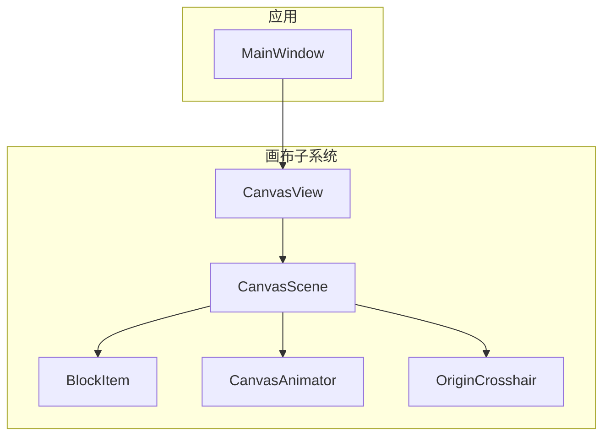
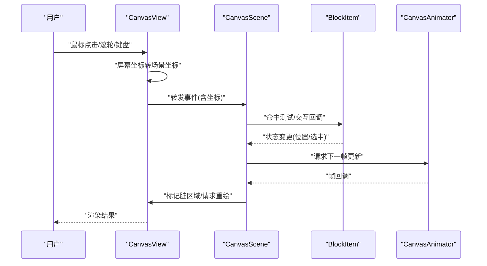
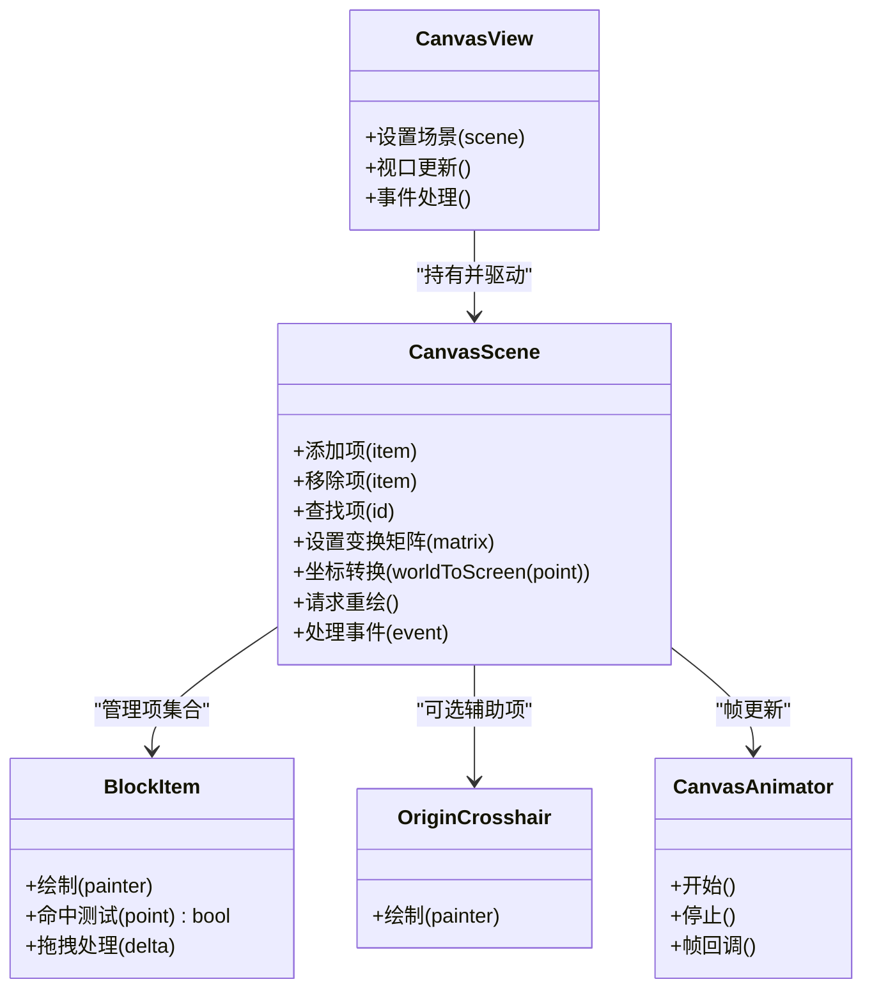
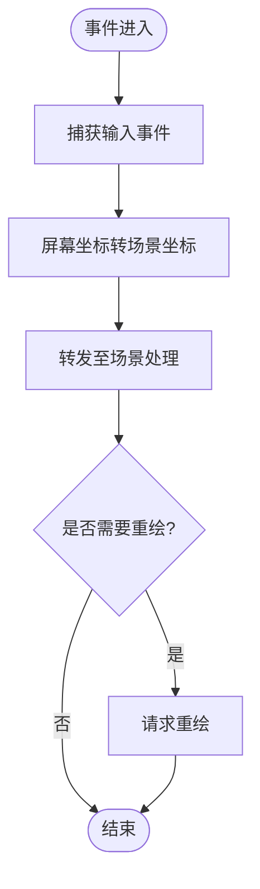
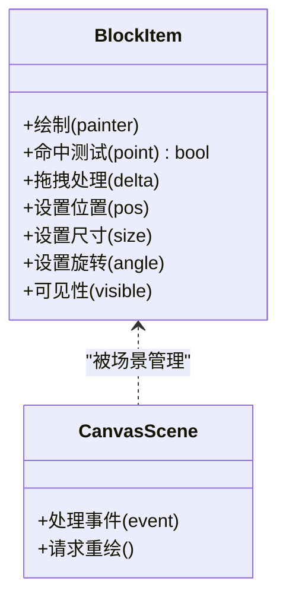
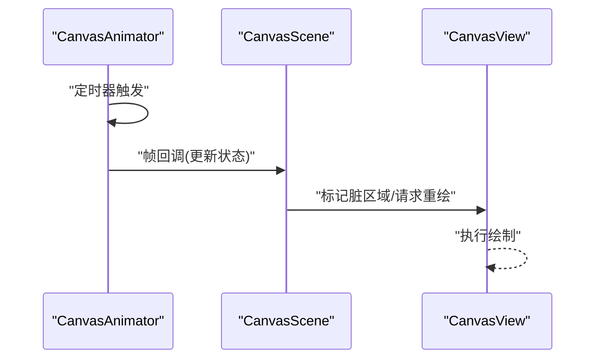
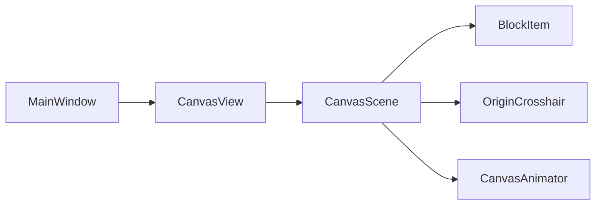

# 场景管理

<cite>
**本文引用的文件**   
- [CanvasScene.h](file://src/canvas/CanvasScene.h)
- [CanvasScene.cpp](file://src/canvas/CanvasScene.cpp)
- [CanvasView.h](file://src/canvas/CanvasView.h)
- [CanvasView.cpp](file://src/canvas/CanvasView.cpp)
- [BlockItem.h](file://src/canvas/BlockItem.h)
- [BlockItem.cpp](file://src/canvas/BlockItem.cpp)
- [CanvasAnimator.h](file://src/canvas/CanvasAnimator.h)
- [CanvasAnimator.cpp](file://src/canvas/CanvasAnimator.cpp)
- [OriginCrosshair.h](file://src/canvas/OriginCrosshair.h)
- [OriginCrosshair.cpp](file://src/canvas/OriginCrosshair.cpp)
- [MainWindow.h](file://src/app/MainWindow.h)
- [MainWindow.cpp](file://src/app/MainWindow.cpp)
</cite>

## 目录
1. [简介](#简介)
2. [项目结构](#项目结构)
3. [核心组件](#核心组件)
4. [架构总览](#架构总览)
5. [详细组件分析](#详细组件分析)
6. [依赖关系分析](#依赖关系分析)
7. [性能考虑](#性能考虑)
8. [故障排查指南](#故障排查指南)
9. [结论](#结论)
10. [附录](#附录)

## 简介
本文件围绕 CanvasScene 场景管理组件，系统性阐述其在图形应用中的职责与实现要点：场景初始化、图形元素（如 BlockItem）的添加与移除、坐标系统与视图变换、渲染流程、与 CanvasView 的交互机制、事件处理系统、生命周期与内存管理，以及性能优化策略。文档同时提供面向开发者的使用示例路径，帮助快速上手创建场景、添加元素并处理用户交互。

## 项目结构
与场景管理相关的代码集中在 src/canvas 目录，核心包括：
- 场景层：CanvasScene（场景容器、元素管理、坐标与变换、渲染调度）
- 视图层：CanvasView（视口、缩放平移、鼠标键盘事件转发）
- 图形项：BlockItem（可绘制、可选择、可交互的块级元素）
- 动画器：CanvasAnimator（帧更新、插值、动画队列）
- 辅助项：OriginCrosshair（原点十字线等辅助视觉）
- 应用入口：MainWindow（集成场景与视图，组织 UI）

图表来源
- [MainWindow.h](file://src/app/MainWindow.h)
- [MainWindow.cpp](file://src/app/MainWindow.cpp)
- [CanvasView.h](file://src/canvas/CanvasView.h)
- [CanvasView.cpp](file://src/canvas/CanvasView.cpp)
- [CanvasScene.h](file://src/canvas/CanvasScene.h)
- [CanvasScene.cpp](file://src/canvas/CanvasScene.cpp)
- [BlockItem.h](file://src/canvas/BlockItem.h)
- [BlockItem.cpp](file://src/canvas/BlockItem.cpp)
- [CanvasAnimator.h](file://src/canvas/CanvasAnimator.h)
- [CanvasAnimator.cpp](file://src/canvas/CanvasAnimator.cpp)
- [OriginCrosshair.h](file://src/canvas/OriginCrosshair.h)
- [OriginCrosshair.cpp](file://src/canvas/OriginCrosshair.cpp)

章节来源
- [CanvasScene.h](file://src/canvas/CanvasScene.h)
- [CanvasScene.cpp](file://src/canvas/CanvasScene.cpp)
- [CanvasView.h](file://src/canvas/CanvasView.h)
- [CanvasView.cpp](file://src/canvas/CanvasView.cpp)
- [BlockItem.h](file://src/canvas/BlockItem.h)
- [BlockItem.cpp](file://src/canvas/BlockItem.cpp)
- [CanvasAnimator.h](file://src/canvas/CanvasAnimator.h)
- [CanvasAnimator.cpp](file://src/canvas/CanvasAnimator.cpp)
- [OriginCrosshair.h](file://src/canvas/OriginCrosshair.h)
- [OriginCrosshair.cpp](file://src/canvas/OriginCrosshair.cpp)
- [MainWindow.h](file://src/app/MainWindow.h)
- [MainWindow.cpp](file://src/app/MainWindow.cpp)

## 核心组件
- CanvasScene
  - 负责场景内所有图形项的注册、查找、排序、可见性控制与批量更新
  - 维护世界坐标系与视图变换矩阵，提供坐标转换工具方法
  - 协调渲染管线，触发重绘与增量更新
  - 与 CanvasView 通过信号槽或回调进行交互
- CanvasView
  - 负责视口几何、缩放和平移、鼠标/键盘事件捕获与分发
  - 将屏幕坐标转换为场景坐标，驱动场景重绘
- BlockItem
  - 表示一个可绘制的块级元素，支持选择、拖拽、旋转、尺寸调整等交互
  - 暴露命中测试接口，供场景进行拾取与碰撞检测
- CanvasAnimator
  - 管理动画帧更新，支持逐帧回调与属性插值
  - 与场景联动，在每帧结束时触发场景更新
- OriginCrosshair
  - 在原点位置绘制参考十字线，辅助定位与对齐

章节来源
- [CanvasScene.h](file://src/canvas/CanvasScene.h)
- [CanvasScene.cpp](file://src/canvas/CanvasScene.cpp)
- [CanvasView.h](file://src/canvas/CanvasView.h)
- [CanvasView.cpp](file://src/canvas/CanvasView.cpp)
- [BlockItem.h](file://src/canvas/BlockItem.h)
- [BlockItem.cpp](file://src/canvas/BlockItem.cpp)
- [CanvasAnimator.h](file://src/canvas/CanvasAnimator.h)
- [CanvasAnimator.cpp](file://src/canvas/CanvasAnimator.cpp)
- [OriginCrosshair.h](file://src/canvas/OriginCrosshair.h)
- [OriginCrosshair.cpp](file://src/canvas/OriginCrosshair.cpp)

## 架构总览
CanvasScene 作为场景容器，与 CanvasView 形成“数据-视图”分离：
- CanvasView 捕获输入与视口变化，调用 CanvasScene 进行坐标转换与重绘
- CanvasScene 维护图形项集合与状态，按需通知 CanvasView 刷新
- BlockItem 作为具体图形项，实现绘制与交互逻辑
- CanvasAnimator 驱动时间推进，周期性更新场景状态
- OriginCrosshair 作为辅助项，常驻场景用于参考显示

图表来源
- [CanvasView.h](file://src/canvas/CanvasView.h)
- [CanvasView.cpp](file://src/canvas/CanvasView.cpp)
- [CanvasScene.h](file://src/canvas/CanvasScene.h)
- [CanvasScene.cpp](file://src/canvas/CanvasScene.cpp)
- [BlockItem.h](file://src/canvas/BlockItem.h)
- [BlockItem.cpp](file://src/canvas/BlockItem.cpp)
- [CanvasAnimator.h](file://src/canvas/CanvasAnimator.h)
- [CanvasAnimator.cpp](file://src/canvas/CanvasAnimator.cpp)

## 详细组件分析

### CanvasScene：场景管理与渲染调度
- 初始化与生命周期
  - 构造时建立内部数据结构（项列表、索引、变换矩阵）
  - 析构时释放资源、断开信号连接、清理动画器
- 图形元素的添加与移除
  - add/remove 接口负责插入/删除项，维护层级与可见性
  - 提供按名称/类型查找与批量更新接口
- 坐标系统与视图变换
  - 维护世界坐标到屏幕坐标的转换矩阵
  - 提供点/矩形/线段等几何体的坐标转换工具
- 渲染流程
  - 根据可见性与裁剪区域计算需要绘制的项
  - 与 CanvasView 协作，触发局部或全局重绘
- 事件处理
  - 接收来自 CanvasView 的事件，进行命中测试与派发
  - 支持多选、拖拽、缩放等复合交互

图表来源
- [CanvasScene.h](file://src/canvas/CanvasScene.h)
- [CanvasScene.cpp](file://src/canvas/CanvasScene.cpp)
- [CanvasView.h](file://src/canvas/CanvasView.h)
- [CanvasView.cpp](file://src/canvas/CanvasView.cpp)
- [BlockItem.h](file://src/canvas/BlockItem.h)
- [BlockItem.cpp](file://src/canvas/BlockItem.cpp)
- [CanvasAnimator.h](file://src/canvas/CanvasAnimator.h)
- [CanvasAnimator.cpp](file://src/canvas/CanvasAnimator.cpp)
- [OriginCrosshair.h](file://src/canvas/OriginCrosshair.h)
- [OriginCrosshair.cpp](file://src/canvas/OriginCrosshair.cpp)

章节来源
- [CanvasScene.h](file://src/canvas/CanvasScene.h)
- [CanvasScene.cpp](file://src/canvas/CanvasScene.cpp)

### CanvasView：视图与事件转发
- 视口管理
  - 维护视口矩形、缩放比例、平移偏移
  - 提供视口更新与重绘触发
- 坐标转换
  - 将屏幕坐标转换为场景坐标，供场景进行命中测试
- 事件处理
  - 捕获鼠标移动、按下、释放、滚轮、键盘事件
  - 将事件与坐标转发给 CanvasScene 处理
- 与场景绑定
  - 设置/获取当前场景实例，驱动场景更新

图表来源
- [CanvasView.h](file://src/canvas/CanvasView.h)
- [CanvasView.cpp](file://src/canvas/CanvasView.cpp)
- [CanvasScene.h](file://src/canvas/CanvasScene.h)
- [CanvasScene.cpp](file://src/canvas/CanvasScene.cpp)

章节来源
- [CanvasView.h](file://src/canvas/CanvasView.h)
- [CanvasView.cpp](file://src/canvas/CanvasView.cpp)

### BlockItem：图形项与交互
- 绘制与命中
  - 实现绘制接口，输出矢量图形
  - 提供命中测试，返回是否包含指定点
- 交互行为
  - 支持选中、拖拽、旋转、尺寸调整
  - 与场景事件系统对接，响应用户操作
- 状态管理
  - 维护位置、尺寸、旋转角度、可见性等属性
  - 属性变更时通知场景进行增量更新

图表来源
- [BlockItem.h](file://src/canvas/BlockItem.h)
- [BlockItem.cpp](file://src/canvas/BlockItem.cpp)
- [CanvasScene.h](file://src/canvas/CanvasScene.h)
- [CanvasScene.cpp](file://src/canvas/CanvasScene.cpp)

章节来源
- [BlockItem.h](file://src/canvas/BlockItem.h)
- [BlockItem.cpp](file://src/canvas/BlockItem.cpp)

### CanvasAnimator：动画与帧更新
- 帧循环
  - 启动/停止动画循环，提供帧回调
- 插值与更新
  - 对属性进行线性或曲线插值，驱动平滑动画
- 与场景联动
  - 每帧结束后通知场景更新，确保渲染一致性

图表来源
- [CanvasAnimator.h](file://src/canvas/CanvasAnimator.h)
- [CanvasAnimator.cpp](file://src/canvas/CanvasAnimator.cpp)
- [CanvasScene.h](file://src/canvas/CanvasScene.h)
- [CanvasScene.cpp](file://src/canvas/CanvasScene.cpp)
- [CanvasView.h](file://src/canvas/CanvasView.h)
- [CanvasView.cpp](file://src/canvas/CanvasView.cpp)

章节来源
- [CanvasAnimator.h](file://src/canvas/CanvasAnimator.h)
- [CanvasAnimator.cpp](file://src/canvas/CanvasAnimator.cpp)

### OriginCrosshair：辅助参考线
- 在原点绘制十字线，辅助对齐与定位
- 作为常驻项加入场景，不参与常规交互

章节来源
- [OriginCrosshair.h](file://src/canvas/OriginCrosshair.h)
- [OriginCrosshair.cpp](file://src/canvas/OriginCrosshair.cpp)

### MainWindow：应用集成
- 创建并配置 CanvasView 与 CanvasScene
- 将场景与视图绑定，初始化默认项与样式
- 提供菜单/工具栏入口以演示场景操作

章节来源
- [MainWindow.h](file://src/app/MainWindow.h)
- [MainWindow.cpp](file://src/app/MainWindow.cpp)

## 依赖关系分析
- CanvasView 依赖 CanvasScene 进行坐标转换与事件分发
- CanvasScene 依赖 BlockItem、OriginCrosshair 等图形项
- CanvasScene 依赖 CanvasAnimator 进行帧更新
- MainWindow 组合 CanvasView 与 CanvasScene，完成应用初始化

图表来源
- [MainWindow.h](file://src/app/MainWindow.h)
- [MainWindow.cpp](file://src/app/MainWindow.cpp)
- [CanvasView.h](file://src/canvas/CanvasView.h)
- [CanvasView.cpp](file://src/canvas/CanvasView.cpp)
- [CanvasScene.h](file://src/canvas/CanvasScene.h)
- [CanvasScene.cpp](file://src/canvas/CanvasScene.cpp)
- [BlockItem.h](file://src/canvas/BlockItem.h)
- [BlockItem.cpp](file://src/canvas/BlockItem.cpp)
- [CanvasAnimator.h](file://src/canvas/CanvasAnimator.h)
- [CanvasAnimator.cpp](file://src/canvas/CanvasAnimator.cpp)
- [OriginCrosshair.h](file://src/canvas/OriginCrosshair.h)
- [OriginCrosshair.cpp](file://src/canvas/OriginCrosshair.cpp)

章节来源
- [CanvasScene.h](file://src/canvas/CanvasScene.h)
- [CanvasScene.cpp](file://src/canvas/CanvasScene.cpp)
- [CanvasView.h](file://src/canvas/CanvasView.h)
- [CanvasView.cpp](file://src/canvas/CanvasView.cpp)
- [BlockItem.h](file://src/canvas/BlockItem.h)
- [BlockItem.cpp](file://src/canvas/BlockItem.cpp)
- [CanvasAnimator.h](file://src/canvas/CanvasAnimator.h)
- [CanvasAnimator.cpp](file://src/canvas/CanvasAnimator.cpp)
- [OriginCrosshair.h](file://src/canvas/OriginCrosshair.h)
- [OriginCrosshair.cpp](file://src/canvas/OriginCrosshair.cpp)
- [MainWindow.h](file://src/app/MainWindow.h)
- [MainWindow.cpp](file://src/app/MainWindow.cpp)

## 性能考虑
- 增量更新
  - 仅对发生变化的项或区域进行重绘，减少不必要的绘制开销
- 空间划分与裁剪
  - 基于视口矩形与项边界框进行裁剪，跳过不可见项的绘制
- 命中测试优化
  - 先进行粗粒度边界框判断，再进行精确命中测试
- 动画与帧率
  - 合理设置动画帧率，避免过高频率导致 CPU/GPU 压力
- 内存管理
  - 及时释放不再使用的项，避免内存泄漏
  - 使用智能指针或所有权模型管理项的生命周期

[本节为通用指导，不直接分析具体文件]

## 故障排查指南
- 场景未渲染
  - 检查 CanvasView 是否正确设置场景实例
  - 确认项的可见性与裁剪区域
- 事件无响应
  - 验证坐标转换是否正确
  - 检查命中测试逻辑与事件转发顺序
- 动画卡顿
  - 降低动画帧率或简化每帧计算
  - 检查是否存在大量无效重绘
- 内存增长
  - 排查项的创建与销毁路径
  - 确认信号槽连接已正确断开

章节来源
- [CanvasView.h](file://src/canvas/CanvasView.h)
- [CanvasView.cpp](file://src/canvas/CanvasView.cpp)
- [CanvasScene.h](file://src/canvas/CanvasScene.h)
- [CanvasScene.cpp](file://src/canvas/CanvasScene.cpp)
- [BlockItem.h](file://src/canvas/BlockItem.h)
- [BlockItem.cpp](file://src/canvas/BlockItem.cpp)
- [CanvasAnimator.h](file://src/canvas/CanvasAnimator.h)
- [CanvasAnimator.cpp](file://src/canvas/CanvasAnimator.cpp)

## 结论
CanvasScene 作为场景管理的核心，提供了完善的图形项管理、坐标与变换、事件处理与渲染调度能力。配合 CanvasView、BlockItem、CanvasAnimator 与 OriginCrosshair，形成了清晰的分层架构与高效的交互体验。遵循本文档的实践建议，可在保证性能的同时实现丰富的用户交互与稳定的生命周期管理。

[本节为总结，不直接分析具体文件]

## 附录
- 使用示例路径（不含代码内容）
  - 创建场景与视图并绑定：参见 [MainWindow.cpp](file://src/app/MainWindow.cpp)
  - 向场景添加 BlockItem：参见 [CanvasScene.cpp](file://src/canvas/CanvasScene.cpp)
  - 处理鼠标拖拽与选中：参见 [BlockItem.cpp](file://src/canvas/BlockItem.cpp)、[CanvasScene.cpp](file://src/canvas/CanvasScene.cpp)
  - 启动/停止动画：参见 [CanvasAnimator.cpp](file://src/canvas/CanvasAnimator.cpp)
  - 坐标转换与视口更新：参见 [CanvasView.cpp](file://src/canvas/CanvasView.cpp)

[本节为指引，不直接分析具体文件]