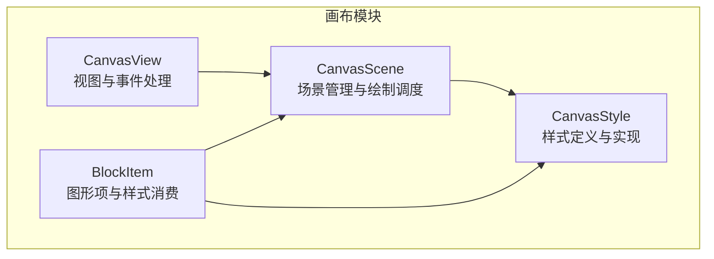
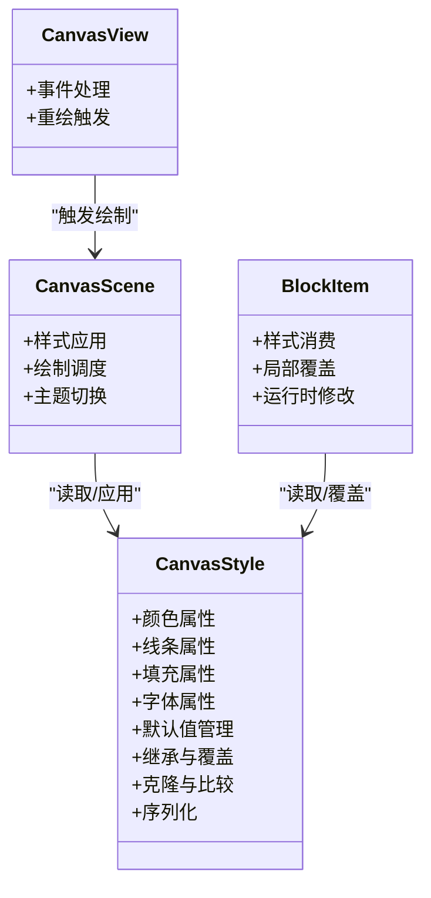
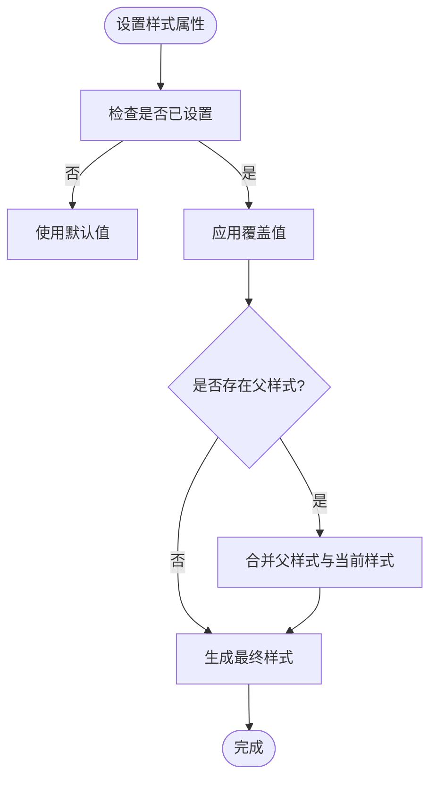
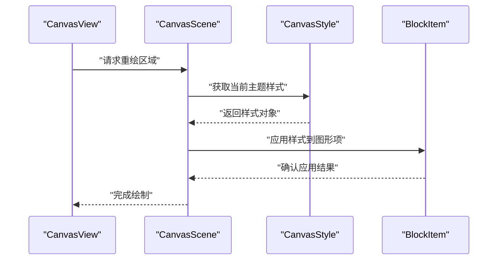
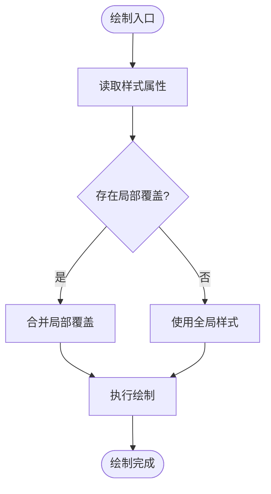
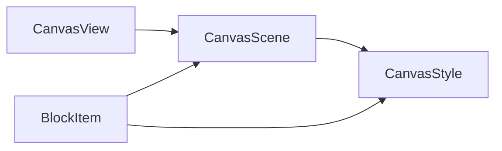

# 样式系统

<cite>
**本文档引用的文件**   
- [CanvasStyle.h](file://src/canvas/CanvasStyle.h)
- [CanvasStyle.cpp](file://src/canvas/CanvasStyle.cpp)
- [CanvasScene.h](file://src/canvas/CanvasScene.h)
- [CanvasScene.cpp](file://src/canvas/CanvasScene.cpp)
- [CanvasView.h](file://src/canvas/CanvasView.h)
- [CanvasView.cpp](file://src/canvas/CanvasView.cpp)
- [BlockItem.h](file://src/canvas/BlockItem.h)
- [BlockItem.cpp](file://src/canvas/BlockItem.cpp)
</cite>

## 目录
1. [简介](#简介)
2. [项目结构](#项目结构)
3. [核心组件](#核心组件)
4. [架构总览](#架构总览)
5. [详细组件分析](#详细组件分析)
6. [依赖关系分析](#依赖关系分析)
7. [性能考虑](#性能考虑)
8. [故障排查指南](#故障排查指南)
9. [结论](#结论)
10. [附录](#附录)

## 简介
本文件为 CanvasStyle 样式系统的完整技术文档，聚焦于样式属性的定义、继承机制、默认值管理、主题切换策略，以及颜色、线条、填充、字体等样式的配置与应用规则。文档同时给出创建自定义样式、动态修改属性、实现样式模板的实践方法，并总结样式缓存与渲染优化策略，帮助开发者在保持高性能的同时获得一致的视觉体验。

## 项目结构
CanvasStyle 位于 canvas 模块中，围绕样式数据模型、样式应用与渲染、场景视图集成展开。关键文件包括：
- 样式定义与实现：CanvasStyle.h/.cpp
- 场景与视图集成：CanvasScene.h/.cpp、CanvasView.h/.cpp
- 图形项使用样式：BlockItem.h/.cpp

图表来源
- [CanvasStyle.h](file://src/canvas/CanvasStyle.h)
- [CanvasStyle.cpp](file://src/canvas/CanvasStyle.cpp)
- [CanvasScene.h](file://src/canvas/CanvasScene.h)
- [CanvasScene.cpp](file://src/canvas/CanvasScene.cpp)
- [CanvasView.h](file://src/canvas/CanvasView.h)
- [CanvasView.cpp](file://src/canvas/CanvasView.cpp)
- [BlockItem.h](file://src/canvas/BlockItem.h)
- [BlockItem.cpp](file://src/canvas/BlockItem.cpp)

章节来源
- [CanvasStyle.h](file://src/canvas/CanvasStyle.h)
- [CanvasStyle.cpp](file://src/canvas/CanvasStyle.cpp)
- [CanvasScene.h](file://src/canvas/CanvasScene.h)
- [CanvasScene.cpp](file://src/canvas/CanvasScene.cpp)
- [CanvasView.h](file://src/canvas/CanvasView.h)
- [CanvasView.cpp](file://src/canvas/CanvasView.cpp)
- [BlockItem.h](file://src/canvas/BlockItem.h)
- [BlockItem.cpp](file://src/canvas/BlockItem.cpp)

## 核心组件
- 样式数据模型（CanvasStyle）
  - 负责封装颜色、线条、填充、字体等样式属性，提供默认值、克隆、比较与序列化能力。
  - 支持样式继承与覆盖，便于构建主题与模板。
- 场景与视图（CanvasScene / CanvasView）
  - 负责将样式应用到具体图形项的绘制流程，协调重绘与更新。
- 图形项（BlockItem）
  - 消费样式对象进行绘制，支持局部覆盖与运行时修改。

章节来源
- [CanvasStyle.h](file://src/canvas/CanvasStyle.h)
- [CanvasStyle.cpp](file://src/canvas/CanvasStyle.cpp)
- [CanvasScene.h](file://src/canvas/CanvasScene.h)
- [CanvasScene.cpp](file://src/canvas/CanvasScene.cpp)
- [CanvasView.h](file://src/canvas/CanvasView.h)
- [CanvasView.cpp](file://src/canvas/CanvasView.cpp)
- [BlockItem.h](file://src/canvas/BlockItem.h)
- [BlockItem.cpp](file://src/canvas/BlockItem.cpp)

## 架构总览
CanvasStyle 作为样式中心，被场景和图形项共同消费；视图层触发重绘，场景统一调度绘制，确保样式一致性与性能。

图表来源
- [CanvasStyle.h](file://src/canvas/CanvasStyle.h)
- [CanvasStyle.cpp](file://src/canvas/CanvasStyle.cpp)
- [CanvasScene.h](file://src/canvas/CanvasScene.h)
- [CanvasScene.cpp](file://src/canvas/CanvasScene.cpp)
- [CanvasView.h](file://src/canvas/CanvasView.h)
- [CanvasView.cpp](file://src/canvas/CanvasView.cpp)
- [BlockItem.h](file://src/canvas/BlockItem.h)
- [BlockItem.cpp](file://src/canvas/BlockItem.cpp)

## 详细组件分析

### 样式数据模型（CanvasStyle）
- 属性分类
  - 颜色：前景色、背景色、透明度等
  - 线条：线宽、线型（实线/虚线）、端点样式、连接样式
  - 填充：填充模式（无/纯色/渐变）、填充色、填充透明度
  - 字体：字号、字重、字体族、对齐方式
- 默认值管理
  - 提供全局默认样式与按类别默认值，未显式设置的属性回退到默认值。
- 继承与覆盖
  - 支持父样式到子样式的继承链，子样式仅覆盖差异部分，减少冗余。
- 克隆与比较
  - 深拷贝避免共享状态污染；相等性比较用于缓存命中判定。
- 序列化
  - 支持导出/导入 JSON 或二进制格式，便于主题与模板持久化。

图表来源
- [CanvasStyle.h](file://src/canvas/CanvasStyle.h)
- [CanvasStyle.cpp](file://src/canvas/CanvasStyle.cpp)

章节来源
- [CanvasStyle.h](file://src/canvas/CanvasStyle.h)
- [CanvasStyle.cpp](file://src/canvas/CanvasStyle.cpp)

### 场景与视图集成（CanvasScene / CanvasView）
- 样式应用
  - 场景在绘制前将 CanvasStyle 应用到图形项的绘制上下文，确保一致性。
- 绘制调度
  - 视图触发重绘时，场景批量更新受影响的图形项，避免全量重绘。
- 主题切换
  - 通过替换根样式或切换主题键，快速刷新界面风格。

图表来源
- [CanvasScene.h](file://src/canvas/CanvasScene.h)
- [CanvasScene.cpp](file://src/canvas/CanvasScene.cpp)
- [CanvasView.h](file://src/canvas/CanvasView.h)
- [CanvasView.cpp](file://src/canvas/CanvasView.cpp)
- [CanvasStyle.h](file://src/canvas/CanvasStyle.h)
- [CanvasStyle.cpp](file://src/canvas/CanvasStyle.cpp)
- [BlockItem.h](file://src/canvas/BlockItem.h)
- [BlockItem.cpp](file://src/canvas/BlockItem.cpp)

章节来源
- [CanvasScene.h](file://src/canvas/CanvasScene.h)
- [CanvasScene.cpp](file://src/canvas/CanvasScene.cpp)
- [CanvasView.h](file://src/canvas/CanvasView.h)
- [CanvasView.cpp](file://src/canvas/CanvasView.cpp)

### 图形项样式消费（BlockItem）
- 样式消费
  - 图形项从 CanvasStyle 读取颜色、线条、填充、字体等属性进行绘制。
- 局部覆盖
  - 支持对单个图形项进行临时覆盖，不影响全局样式。
- 运行时修改
  - 允许在交互过程中动态调整样式属性，并触发增量重绘。

图表来源
- [BlockItem.h](file://src/canvas/BlockItem.h)
- [BlockItem.cpp](file://src/canvas/BlockItem.cpp)
- [CanvasStyle.h](file://src/canvas/CanvasStyle.h)
- [CanvasStyle.cpp](file://src/canvas/CanvasStyle.cpp)

章节来源
- [BlockItem.h](file://src/canvas/BlockItem.h)
- [BlockItem.cpp](file://src/canvas/BlockItem.cpp)

### 主题切换与样式模板
- 主题切换
  - 通过主题键映射到不同的根样式集合，切换时批量替换并触发重绘。
- 样式模板
  - 基于父样式构建模板，子类仅声明差异，降低维护成本。
- 示例实践
  - 创建自定义样式：以默认样式为基类，覆盖必要属性后注册为模板。
  - 动态修改样式属性：在交互事件中更新样式字段并标记脏区。
  - 实现样式模板：定义通用模板（如“高亮”、“选中”），由业务逻辑按需应用。

章节来源
- [CanvasStyle.h](file://src/canvas/CanvasStyle.h)
- [CanvasStyle.cpp](file://src/canvas/CanvasStyle.cpp)
- [CanvasScene.h](file://src/canvas/CanvasScene.h)
- [CanvasScene.cpp](file://src/canvas/CanvasScene.cpp)

## 依赖关系分析
- 组件耦合
  - CanvasStyle 被 CanvasScene 与 BlockItem 共同依赖，形成松耦合的样式消费模型。
  - CanvasView 仅与 CanvasScene 交互，不直接访问样式，职责清晰。
- 外部依赖
  - 样式序列化可能依赖 JSON/二进制库；主题切换可能依赖配置管理器。
- 循环依赖
  - 通过接口分离与依赖注入避免循环引用。

图表来源
- [CanvasView.h](file://src/canvas/CanvasView.h)
- [CanvasView.cpp](file://src/canvas/CanvasView.cpp)
- [CanvasScene.h](file://src/canvas/CanvasScene.h)
- [CanvasScene.cpp](file://src/canvas/CanvasScene.cpp)
- [CanvasStyle.h](file://src/canvas/CanvasStyle.h)
- [CanvasStyle.cpp](file://src/canvas/CanvasStyle.cpp)
- [BlockItem.h](file://src/canvas/BlockItem.h)
- [BlockItem.cpp](file://src/canvas/BlockItem.cpp)

章节来源
- [CanvasView.h](file://src/canvas/CanvasView.h)
- [CanvasView.cpp](file://src/canvas/CanvasView.cpp)
- [CanvasScene.h](file://src/canvas/CanvasScene.h)
- [CanvasScene.cpp](file://src/canvas/CanvasScene.cpp)
- [CanvasStyle.h](file://src/canvas/CanvasStyle.h)
- [CanvasStyle.cpp](file://src/canvas/CanvasStyle.cpp)
- [BlockItem.h](file://src/canvas/BlockItem.h)
- [BlockItem.cpp](file://src/canvas/BlockItem.cpp)

## 性能考虑
- 样式缓存
  - 基于样式哈希或相等性比较缓存绘制上下文，减少重复计算。
- 增量重绘
  - 仅重绘受样式变更影响的区域，避免全量刷新。
- 懒加载与延迟解析
  - 对复杂样式（如渐变）采用懒解析，首次使用时再计算。
- 内存管理
  - 使用浅拷贝与共享只读样式，降低内存占用。
- 批量操作
  - 批量应用样式与批量提交绘制命令，减少调用开销。

[本节为通用性能建议，无需特定文件来源]

## 故障排查指南
- 常见问题
  - 样式未生效：检查样式是否被正确应用到绘制上下文，确认覆盖优先级。
  - 主题切换无效：确认主题键映射是否正确，重绘是否被触发。
  - 性能下降：检查是否存在全量重绘、样式频繁重建或未命中缓存。
- 调试技巧
  - 输出样式差异日志，定位覆盖冲突。
  - 使用帧率与绘制耗时统计工具，识别瓶颈。
  - 隔离测试：最小化复现场景，逐步缩小问题范围。

章节来源
- [CanvasStyle.h](file://src/canvas/CanvasStyle.h)
- [CanvasStyle.cpp](file://src/canvas/CanvasStyle.cpp)
- [CanvasScene.h](file://src/canvas/CanvasScene.h)
- [CanvasScene.cpp](file://src/canvas/CanvasScene.cpp)
- [CanvasView.h](file://src/canvas/CanvasView.h)
- [CanvasView.cpp](file://src/canvas/CanvasView.cpp)
- [BlockItem.h](file://src/canvas/BlockItem.h)
- [BlockItem.cpp](file://src/canvas/BlockItem.cpp)

## 结论
CanvasStyle 样式系统通过清晰的属性模型、灵活的继承与覆盖机制、完善的默认值管理与主题切换能力，为画布渲染提供了稳定高效的支撑。结合样式缓存与增量重绘策略，可在保证视觉一致性的同时实现良好的性能表现。开发者可基于模板与主题快速构建多样化样式方案，并通过运行时修改满足交互需求。

[本节为总结性内容，无需特定文件来源]

## 附录
- 最佳实践
  - 优先使用模板与主题，减少重复定义。
  - 谨慎使用运行时覆盖，避免破坏整体一致性。
  - 定期清理无用样式与主题，控制内存增长。
- 扩展建议
  - 增加更多样式类型（如阴影、描边效果）。
  - 引入样式动画与过渡效果。
  - 提供可视化样式编辑器与实时预览。

[本节为补充性内容，无需特定文件来源]