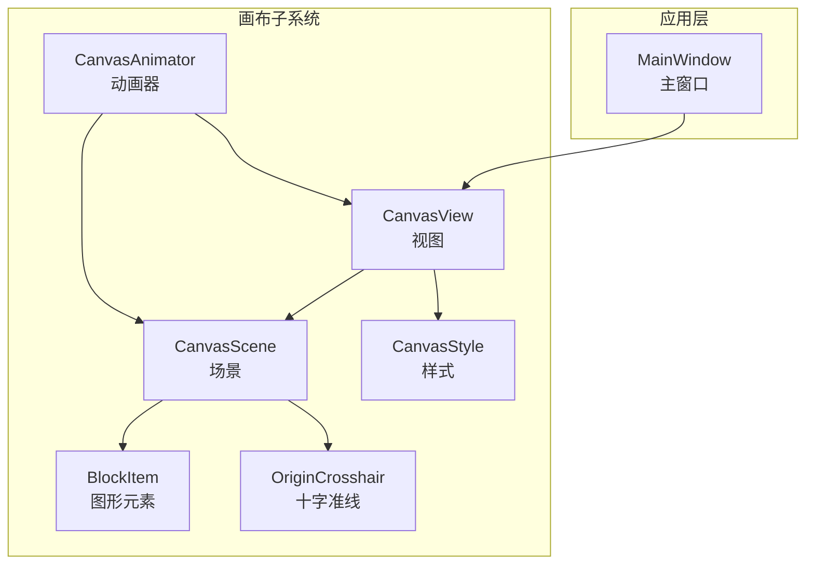
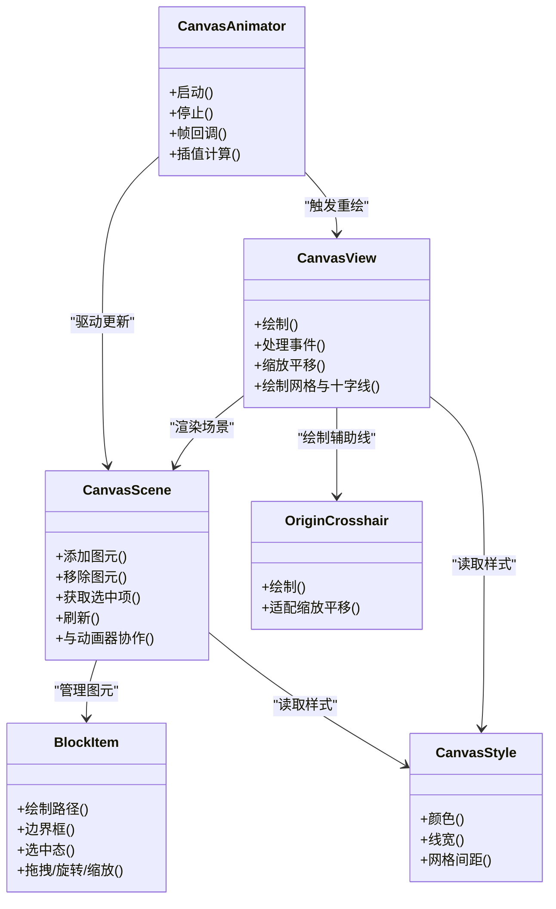
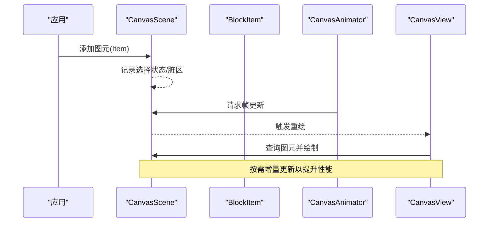
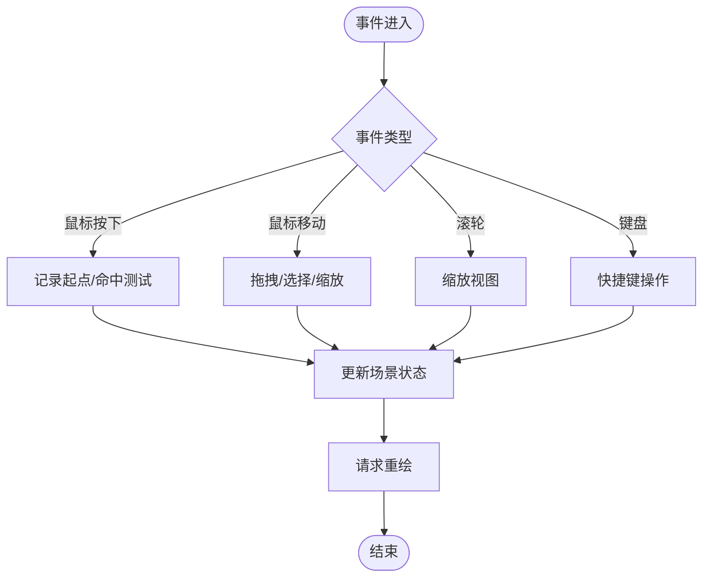
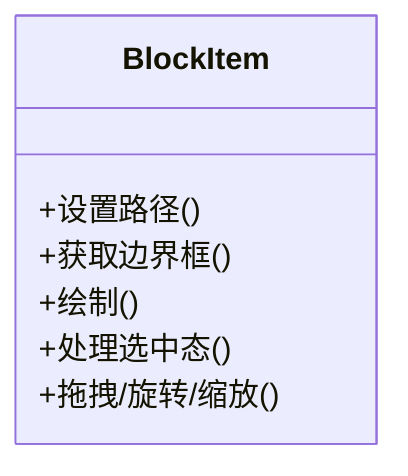
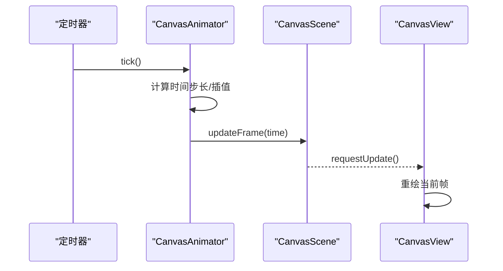
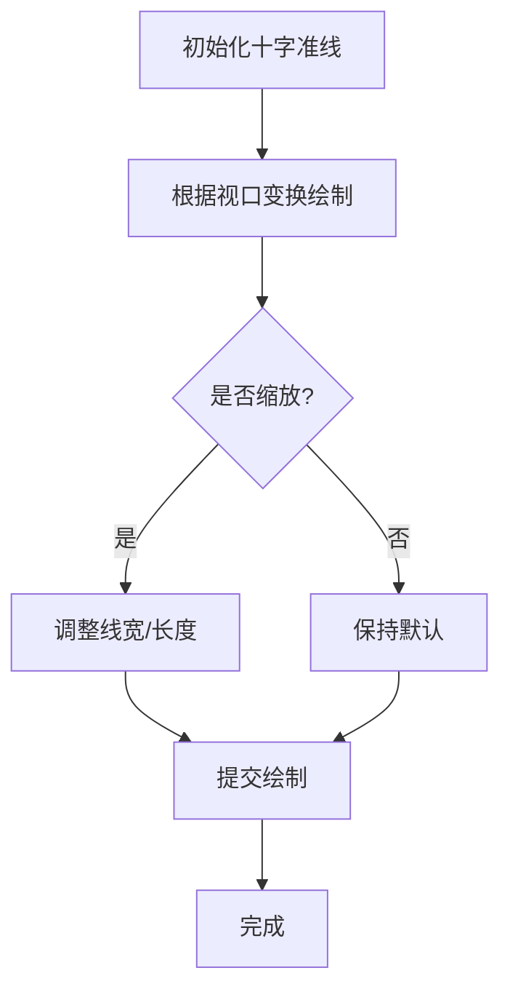
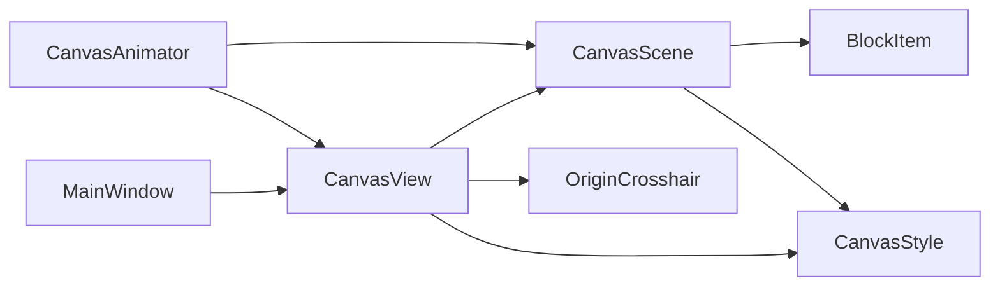

# 画布系统

<cite>
**本文引用的文件**   
- [CanvasScene.h](file://src/canvas/CanvasScene.h)
- [CanvasScene.cpp](file://src/canvas/CanvasScene.cpp)
- [CanvasView.h](file://src/canvas/CanvasView.h)
- [CanvasView.cpp](file://src/canvas/CanvasView.cpp)
- [BlockItem.h](file://src/canvas/BlockItem.h)
- [BlockItem.cpp](file://src/canvas/BlockItem.cpp)
- [CanvasAnimator.h](file://src/canvas/CanvasAnimator.h)
- [CanvasAnimator.cpp](file://src/canvas/CanvasAnimator.cpp)
- [OriginCrosshair.h](file://src/canvas/OriginCrosshair.h)
- [OriginCrosshair.cpp](file://src/canvas/OriginCrosshair.cpp)
- [CanvasStyle.h](file://src/canvas/CanvasStyle.h)
- [CanvasStyle.cpp](file://src/canvas/CanvasStyle.cpp)
- [MainWindow.h](file://src/app/MainWindow.h)
- [MainWindow.cpp](file://src/app/MainWindow.cpp)
</cite>

## 目录
1. [简介](#简介)
2. [项目结构](#项目结构)
3. [核心组件](#核心组件)
4. [架构总览](#架构总览)
5. [详细组件分析](#详细组件分析)
6. [依赖关系分析](#依赖关系分析)
7. [性能考虑](#性能考虑)
8. [故障排查指南](#故障排查指南)
9. [结论](#结论)
10. [附录](#附录)

## 简介
本文件为“画布系统”的权威技术文档，聚焦于场景管理、视图渲染、图形元素、动画系统与十字准线功能。内容覆盖实现细节、调用关系、接口契约、领域模型与使用模式，并提供来自实际代码库的路径引用，帮助初学者快速上手，同时为有经验的开发者提供足够的深度。

## 项目结构
画布系统位于 src/canvas 目录下，围绕 Qt Graphics View Framework 构建，主要模块包括：
- CanvasScene：场景管理与对象生命周期
- CanvasView：视图渲染与交互事件处理
- BlockItem：可绘制、可选中的图形元素
- CanvasAnimator：基于时间轴的动画驱动
- OriginCrosshair：原点十字准线辅助显示
- CanvasStyle：样式配置（颜色、线宽等）

图表来源
- [MainWindow.h](file://src/app/MainWindow.h)
- [MainWindow.cpp](file://src/app/MainWindow.cpp)
- [CanvasView.h](file://src/canvas/CanvasView.h)
- [CanvasScene.h](file://src/canvas/CanvasScene.h)
- [BlockItem.h](file://src/canvas/BlockItem.h)
- [CanvasAnimator.h](file://src/canvas/CanvasAnimator.h)
- [OriginCrosshair.h](file://src/canvas/OriginCrosshair.h)
- [CanvasStyle.h](file://src/canvas/CanvasStyle.h)

章节来源
- [MainWindow.h](file://src/app/MainWindow.h)
- [MainWindow.cpp](file://src/app/MainWindow.cpp)
- [CanvasView.h](file://src/canvas/CanvasView.h)
- [CanvasScene.h](file://src/canvas/CanvasScene.h)
- [BlockItem.h](file://src/canvas/BlockItem.h)
- [CanvasAnimator.h](file://src/canvas/CanvasAnimator.h)
- [OriginCrosshair.h](file://src/canvas/OriginCrosshair.h)
- [CanvasStyle.h](file://src/canvas/CanvasStyle.h)

## 核心组件
- CanvasScene
  - 职责：维护图元集合、选择状态、坐标变换、撤销/重做扩展点、动画帧更新入口
  - 关键能力：添加/移除图元、查询选中项、批量刷新、与动画器协作
- CanvasView
  - 职责：渲染视图、处理鼠标/键盘事件、缩放平移、网格与十字线绘制
  - 关键能力：事件分发、视口变换、自定义绘制钩子
- BlockItem
  - 职责：表示一个可绘制的块（如服装纸样块），支持选中态、拖拽、旋转、尺寸调整
  - 关键能力：几何边界计算、绘制路径、交互响应
- CanvasAnimator
  - 职责：驱动时间轴、触发帧回调、协调场景与视图的增量更新
  - 关键能力：定时器/帧循环、插值计算、暂停/恢复
- OriginCrosshair
  - 职责：在原点位置绘制十字准线，辅助对齐与定位
  - 关键能力：随视图缩放/平移自适应绘制
- CanvasStyle
  - 职责：集中管理颜色、线宽、字体、网格间距等视觉参数
  - 关键能力：全局样式访问、主题切换

章节来源
- [CanvasScene.h](file://src/canvas/CanvasScene.h)
- [CanvasScene.cpp](file://src/canvas/CanvasScene.cpp)
- [CanvasView.h](file://src/canvas/CanvasView.h)
- [CanvasView.cpp](file://src/canvas/CanvasView.cpp)
- [BlockItem.h](file://src/canvas/BlockItem.h)
- [BlockItem.cpp](file://src/canvas/BlockItem.cpp)
- [CanvasAnimator.h](file://src/canvas/CanvasAnimator.h)
- [CanvasAnimator.cpp](file://src/canvas/CanvasAnimator.cpp)
- [OriginCrosshair.h](file://src/canvas/OriginCrosshair.h)
- [OriginCrosshair.cpp](file://src/canvas/OriginCrosshair.cpp)
- [CanvasStyle.h](file://src/canvas/CanvasStyle.h)
- [CanvasStyle.cpp](file://src/canvas/CanvasStyle.cpp)

## 架构总览
画布系统采用典型的 MVC 变体：CanvasScene 作为模型与控制器混合层，CanvasView 负责视图与输入，BlockItem 作为数据承载与绘制单元，CanvasAnimator 作为外部驱动源，OriginCrosshair 与 CanvasStyle 提供辅助能力。

图表来源
- [CanvasScene.h](file://src/canvas/CanvasScene.h)
- [CanvasView.h](file://src/canvas/CanvasView.h)
- [BlockItem.h](file://src/canvas/BlockItem.h)
- [CanvasAnimator.h](file://src/canvas/CanvasAnimator.h)
- [OriginCrosshair.h](file://src/canvas/OriginCrosshair.h)
- [CanvasStyle.h](file://src/canvas/CanvasStyle.h)

## 详细组件分析

### CanvasScene 场景管理
- 设计要点
  - 图元容器：维护 BlockItem 列表与选择集
  - 坐标系统：与世界坐标/视图坐标转换
  - 更新策略：增量刷新与全量刷新
  - 动画集成：暴露帧更新接口供 CanvasAnimator 调用
- 典型流程
  - 添加图元后标记脏区域，等待视图重绘
  - 选中项变更时广播通知，便于 UI 联动
  - 与 CanvasStyle 协同，统一外观

图表来源
- [CanvasScene.h](file://src/canvas/CanvasScene.h)
- [CanvasScene.cpp](file://src/canvas/CanvasScene.cpp)
- [BlockItem.h](file://src/canvas/BlockItem.h)
- [CanvasAnimator.h](file://src/canvas/CanvasAnimator.h)
- [CanvasView.h](file://src/canvas/CanvasView.h)

章节来源
- [CanvasScene.h](file://src/canvas/CanvasScene.h)
- [CanvasScene.cpp](file://src/canvas/CanvasScene.cpp)

### CanvasView 视图渲染
- 设计要点
  - 事件处理：鼠标按下/移动/释放、滚轮缩放、键盘操作
  - 渲染管线：背景网格、十字准线、图元绘制、选中高亮
  - 变换矩阵：平移、缩放、旋转对绘制的影响
- 典型流程
  - 用户交互 -> 事件解析 -> 命中测试 -> 更新场景状态 -> 请求重绘

图表来源
- [CanvasView.h](file://src/canvas/CanvasView.h)
- [CanvasView.cpp](file://src/canvas/CanvasView.cpp)

章节来源
- [CanvasView.h](file://src/canvas/CanvasView.h)
- [CanvasView.cpp](file://src/canvas/CanvasView.cpp)

### BlockItem 图形元素
- 设计要点
  - 几何描述：多段线/闭合路径、边界框计算
  - 交互能力：选中态、拖拽、旋转、角点缩放
  - 绘制优化：路径缓存、选择性绘制
- 典型用法
  - 创建 BlockItem 并设置路径
  - 添加到 CanvasScene
  - 通过 CanvasView 进行交互

图表来源
- [BlockItem.h](file://src/canvas/BlockItem.h)
- [BlockItem.cpp](file://src/canvas/BlockItem.cpp)

章节来源
- [BlockItem.h](file://src/canvas/BlockItem.h)
- [BlockItem.cpp](file://src/canvas/BlockItem.cpp)

### 动画系统 CanvasAnimator
- 设计要点
  - 时间驱动：基于定时器或帧回调推进时间
  - 插值算法：线性/缓动函数，支持多属性同步
  - 生命周期：启动、暂停、恢复、停止
- 与场景/视图协作
  - 每帧回调 CanvasScene::updateFrame()
  - 触发 CanvasView::viewportUpdate()

图表来源
- [CanvasAnimator.h](file://src/canvas/CanvasAnimator.h)
- [CanvasAnimator.cpp](file://src/canvas/CanvasAnimator.cpp)
- [CanvasScene.h](file://src/canvas/CanvasScene.h)
- [CanvasView.h](file://src/canvas/CanvasView.h)

章节来源
- [CanvasAnimator.h](file://src/canvas/CanvasAnimator.h)
- [CanvasAnimator.cpp](file://src/canvas/CanvasAnimator.cpp)

### 十字准线 OriginCrosshair
- 设计要点
  - 始终显示在视图原点，随缩放/平移保持比例
  - 独立绘制层，避免影响图元绘制性能
- 使用建议
  - 开启/关闭由用户偏好控制
  - 与网格系统配合提升对齐精度

图表来源
- [OriginCrosshair.h](file://src/canvas/OriginCrosshair.h)
- [OriginCrosshair.cpp](file://src/canvas/OriginCrosshair.cpp)

章节来源
- [OriginCrosshair.h](file://src/canvas/OriginCrosshair.h)
- [OriginCrosshair.cpp](file://src/canvas/OriginCrosshair.cpp)

### 样式系统 CanvasStyle
- 设计要点
  - 集中式样式表：颜色、线宽、字体、网格间距
  - 主题切换：运行时修改样式并触发重绘
- 使用建议
  - 通过单例或全局访问器获取样式
  - 避免在热路径中频繁分配内存

章节来源
- [CanvasStyle.h](file://src/canvas/CanvasStyle.h)
- [CanvasStyle.cpp](file://src/canvas/CanvasStyle.cpp)

## 依赖关系分析
- 耦合度
  - CanvasView 强依赖 CanvasScene（渲染目标）
  - CanvasScene 弱依赖 BlockItem（图元抽象）
  - CanvasAnimator 与 CanvasScene/CanvasView 松耦合（通过回调）
  - OriginCrosshair 与 CanvasView 解耦（仅绘制）
- 外部依赖
  - Qt Graphics View Framework（场景/视图/图元基类）
  - 定时器/线程（动画驱动）

图表来源
- [MainWindow.h](file://src/app/MainWindow.h)
- [MainWindow.cpp](file://src/app/MainWindow.cpp)
- [CanvasView.h](file://src/canvas/CanvasView.h)
- [CanvasScene.h](file://src/canvas/CanvasScene.h)
- [BlockItem.h](file://src/canvas/BlockItem.h)
- [CanvasAnimator.h](file://src/canvas/CanvasAnimator.h)
- [OriginCrosshair.h](file://src/canvas/OriginCrosshair.h)
- [CanvasStyle.h](file://src/canvas/CanvasStyle.h)

章节来源
- [MainWindow.h](file://src/app/MainWindow.h)
- [MainWindow.cpp](file://src/app/MainWindow.cpp)
- [CanvasView.h](file://src/canvas/CanvasView.h)
- [CanvasScene.h](file://src/canvas/CanvasScene.h)
- [BlockItem.h](file://src/canvas/BlockItem.h)
- [CanvasAnimator.h](file://src/canvas/CanvasAnimator.h)
- [OriginCrosshair.h](file://src/canvas/OriginCrosshair.h)
- [CanvasStyle.h](file://src/canvas/CanvasStyle.h)

## 性能考虑
- 渲染优化
  - 使用脏矩形/增量更新，避免全量重绘
  - 路径缓存与共享画笔，减少重复计算
- 交互优化
  - 命中测试优先使用边界框预筛选
  - 大场景下启用视锥剔除
- 动画优化
  - 固定时间步长，避免抖动
  - 合并多属性更新，减少重绘次数

[本节为通用指导，不直接分析具体文件]

## 故障排查指南
- 常见问题
  - 图元不显示：检查是否已添加到 CanvasScene 且可见性正确
  - 交互无响应：确认事件是否在 CanvasView 中正确处理并转发到 CanvasScene
  - 动画卡顿：检查时间步长与插值计算复杂度，必要时降低帧率
  - 十字准线错位：验证视口变换矩阵是否正确传递
- 调试建议
  - 打印脏区域与重绘次数，定位过度绘制
  - 使用断点跟踪事件链路与动画回调
  - 临时关闭复杂效果（阴影、抗锯齿）以隔离问题

章节来源
- [CanvasView.h](file://src/canvas/CanvasView.h)
- [CanvasView.cpp](file://src/canvas/CanvasView.cpp)
- [CanvasScene.h](file://src/canvas/CanvasScene.h)
- [CanvasScene.cpp](file://src/canvas/CanvasScene.cpp)
- [CanvasAnimator.h](file://src/canvas/CanvasAnimator.h)
- [CanvasAnimator.cpp](file://src/canvas/CanvasAnimator.cpp)
- [OriginCrosshair.h](file://src/canvas/OriginCrosshair.h)
- [OriginCrosshair.cpp](file://src/canvas/OriginCrosshair.cpp)

## 结论
画布系统以清晰的职责划分与松耦合设计，实现了可扩展的场景管理、高效的视图渲染、灵活的图形元素与稳定的动画驱动。通过统一的样式系统与辅助十字准线，提升了用户体验与开发效率。建议在大规模场景中引入更精细的更新策略与资源管理，以获得更好的性能表现。

[本节为总结，不直接分析具体文件]

## 附录
- 使用模式示例（路径引用）
  - 创建场景与视图并嵌入主窗口：参考 [MainWindow.h](file://src/app/MainWindow.h)、[MainWindow.cpp](file://src/app/MainWindow.cpp)
  - 添加 BlockItem 到场景：参考 [CanvasScene.h](file://src/canvas/CanvasScene.h)、[BlockItem.h](file://src/canvas/BlockItem.h)
  - 启动动画：参考 [CanvasAnimator.h](file://src/canvas/CanvasAnimator.h)、[CanvasAnimator.cpp](file://src/canvas/CanvasAnimator.cpp)
  - 切换样式主题：参考 [CanvasStyle.h](file://src/canvas/CanvasStyle.h)、[CanvasStyle.cpp](file://src/canvas/CanvasStyle.cpp)

[本节为补充信息，不直接分析具体文件]