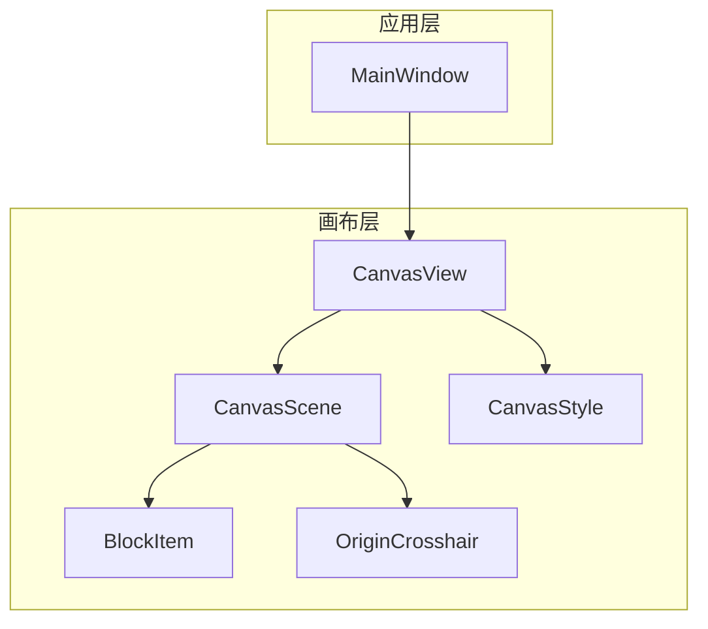
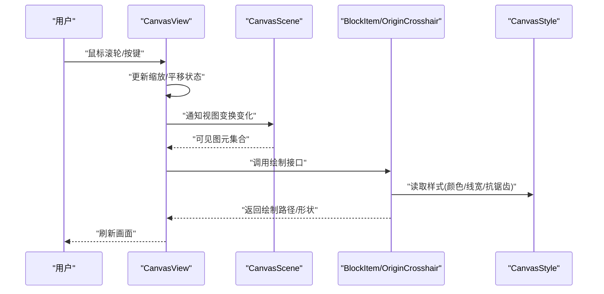
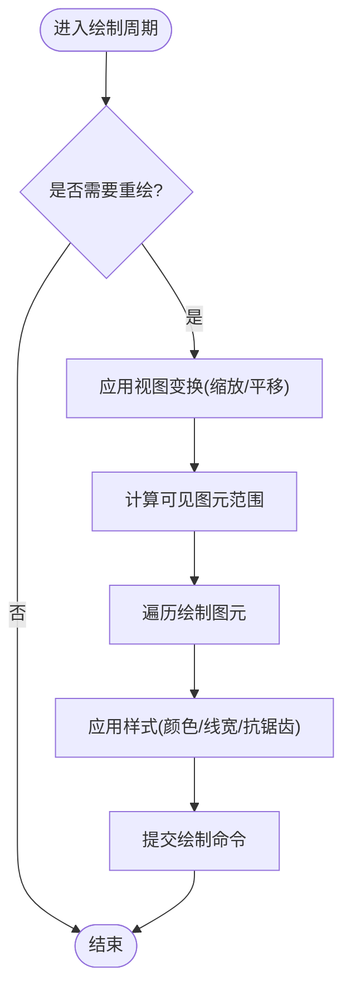
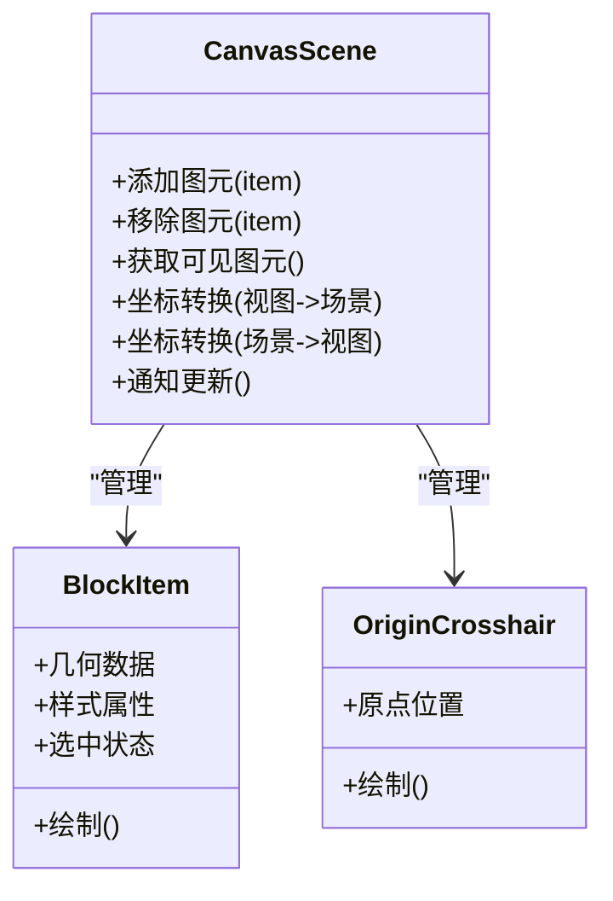
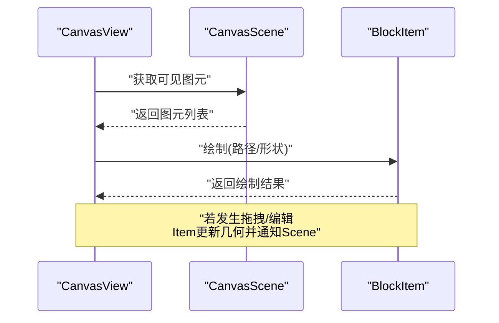
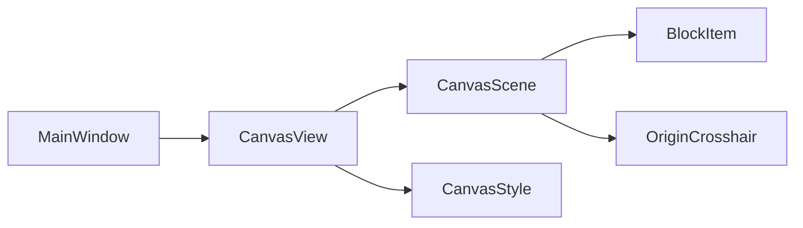

# 视图渲染

<cite>
**本文引用的文件**   
- [CanvasView.h](file://src/canvas/CanvasView.h)
- [CanvasView.cpp](file://src/canvas/CanvasView.cpp)
- [CanvasScene.h](file://src/canvas/CanvasScene.h)
- [CanvasScene.cpp](file://src/canvas/CanvasScene.cpp)
- [BlockItem.h](file://src/canvas/BlockItem.h)
- [BlockItem.cpp](file://src/canvas/BlockItem.cpp)
- [OriginCrosshair.h](file://src/canvas/OriginCrosshair.h)
- [OriginCrosshair.cpp](file://src/canvas/OriginCrosshair.cpp)
- [CanvasStyle.h](file://src/canvas/CanvasStyle.h)
- [CanvasStyle.cpp](file://src/canvas/CanvasStyle.cpp)
- [MainWindow.h](file://src/app/MainWindow.h)
- [MainWindow.cpp](file://src/app/MainWindow.cpp)
</cite>

## 目录
1. [简介](#简介)
2. [项目结构](#项目结构)
3. [核心组件](#核心组件)
4. [架构总览](#架构总览)
5. [详细组件分析](#详细组件分析)
6. [依赖关系分析](#依赖关系分析)
7. [性能考虑](#性能考虑)
8. [故障排查指南](#故障排查指南)
9. [结论](#结论)
10. [附录：示例与最佳实践](#附录示例与最佳实践)

## 简介
本文件围绕 CanvasView 视图渲染组件，系统化说明其绘制循环、缩放和平移交互、鼠标事件处理、键盘快捷键支持，以及与场景（CanvasScene）的数据同步机制。文档还涵盖渲染优化策略、抗锯齿设置、视图状态管理与重绘机制，并提供自定义绘制、用户输入处理和窗口大小变化的具体实现指引。

## 项目结构
CanvasView 位于 src/canvas 模块，与 CanvasScene、BlockItem、OriginCrosshair、CanvasStyle 等协同工作；应用入口 MainWindow 负责创建并装配这些组件。

图表来源
- [MainWindow.h](file://src/app/MainWindow.h)
- [MainWindow.cpp](file://src/app/MainWindow.cpp)
- [CanvasView.h](file://src/canvas/CanvasView.h)
- [CanvasScene.h](file://src/canvas/CanvasScene.h)
- [BlockItem.h](file://src/canvas/BlockItem.h)
- [OriginCrosshair.h](file://src/canvas/OriginCrosshair.h)
- [CanvasStyle.h](file://src/canvas/CanvasStyle.h)

章节来源
- [MainWindow.h](file://src/app/MainWindow.h)
- [MainWindow.cpp](file://src/app/MainWindow.cpp)
- [CanvasView.h](file://src/canvas/CanvasView.h)
- [CanvasScene.h](file://src/canvas/CanvasScene.h)

## 核心组件
- CanvasView：Qt Graphics View 的视图封装，负责视口变换（平移/缩放）、事件分发、绘制管线控制与重绘调度。
- CanvasScene：场景容器，管理图元（如 BlockItem、OriginCrosshair），提供坐标系统与数据模型。
- BlockItem：业务图元，承载几何与样式信息，响应选中、拖拽等交互。
- OriginCrosshair：原点十字线辅助显示。
- CanvasStyle：统一样式配置（颜色、线宽、抗锯齿等）。

章节来源
- [CanvasView.h](file://src/canvas/CanvasView.h)
- [CanvasView.cpp](file://src/canvas/CanvasView.cpp)
- [CanvasScene.h](file://src/canvas/CanvasScene.h)
- [CanvasScene.cpp](file://src/canvas/CanvasScene.cpp)
- [BlockItem.h](file://src/canvas/BlockItem.h)
- [BlockItem.cpp](file://src/canvas/BlockItem.cpp)
- [OriginCrosshair.h](file://src/canvas/OriginCrosshair.h)
- [OriginCrosshair.cpp](file://src/canvas/OriginCrosshair.cpp)
- [CanvasStyle.h](file://src/canvas/CanvasStyle.h)
- [CanvasStyle.cpp](file://src/canvas/CanvasStyle.cpp)

## 架构总览
CanvasView 通过 QGraphicsView 的绘制循环驱动渲染，将 CanvasScene 中的图元按当前视口变换进行绘制。交互事件由 CanvasView 捕获并转发到 CanvasScene 或图元，完成选择、移动、缩放等操作后触发重绘。

图表来源
- [CanvasView.cpp](file://src/canvas/CanvasView.cpp)
- [CanvasScene.cpp](file://src/canvas/CanvasScene.cpp)
- [BlockItem.cpp](file://src/canvas/BlockItem.cpp)
- [OriginCrosshair.cpp](file://src/canvas/OriginCrosshair.cpp)
- [CanvasStyle.cpp](file://src/canvas/CanvasStyle.cpp)

## 详细组件分析

### CanvasView 视图渲染与事件处理
- 绘制循环
  - 基于 QGraphicsView 的 update()/repaint() 机制，结合视口变换矩阵，按需重绘可见区域。
  - 可通过重写关键绘制钩子以启用高级特性（如双缓冲、自定义背景绘制）。
- 缩放与平移
  - 使用缩放因子与平移偏移量维护视图状态；滚轮事件用于缩放，鼠标拖拽用于平移。
  - 在事件回调中更新变换矩阵并触发局部重绘。
- 鼠标事件
  - 按下/移动/释放事件用于选择、框选、拖拽图元；悬停事件可用于提示或高亮。
  - 事件坐标经视图变换转换为场景坐标，再分发给场景或图元。
- 键盘快捷键
  - 监听常用键（如空格+拖拽平移、Ctrl+滚轮缩放、Delete删除、Z撤销等），在 keyPressEvent 中分发。
- 抗锯齿与渲染质量
  - 通过 QPainter 的抗锯齿属性与 CanvasStyle 的统一配置，确保线条与文本清晰。
- 重绘机制
  - 变更视图状态（缩放/平移）或场景内容时，调用 update() 请求增量重绘；必要时使用 repaint() 强制全量刷新。

图表来源
- [CanvasView.cpp](file://src/canvas/CanvasView.cpp)
- [CanvasStyle.cpp](file://src/canvas/CanvasStyle.cpp)

章节来源
- [CanvasView.h](file://src/canvas/CanvasView.h)
- [CanvasView.cpp](file://src/canvas/CanvasView.cpp)

### CanvasScene 场景与数据同步
- 图元管理
  - 添加/移除/查询图元（BlockItem、OriginCrosshair），维护图元层级与可见性。
- 坐标系统
  - 提供场景坐标与视图坐标转换方法，供 CanvasView 与图元之间互转。
- 数据同步
  - 当图元状态改变（位置、尺寸、样式）时，向视图广播更新信号，触发重绘。
- 选择与交互
  - 维护选中集合，处理多选、框选、撤销/重做等逻辑。

图表来源
- [CanvasScene.h](file://src/canvas/CanvasScene.h)
- [BlockItem.h](file://src/canvas/BlockItem.h)
- [OriginCrosshair.h](file://src/canvas/OriginCrosshair.h)

章节来源
- [CanvasScene.h](file://src/canvas/CanvasScene.h)
- [CanvasScene.cpp](file://src/canvas/CanvasScene.cpp)
- [BlockItem.h](file://src/canvas/BlockItem.h)
- [BlockItem.cpp](file://src/canvas/BlockItem.cpp)
- [OriginCrosshair.h](file://src/canvas/OriginCrosshair.h)
- [OriginCrosshair.cpp](file://src/canvas/OriginCrosshair.cpp)

### BlockItem 图元绘制与交互
- 数据结构
  - 包含几何参数（点集、线段、多边形等）与样式（填充色、描边色、线宽）。
- 绘制流程
  - 根据当前视图变换生成路径，应用样式后交由 QPainter 绘制。
- 交互行为
  - 响应选中、拖拽、调整锚点等事件，更新自身几何并通知场景。

图表来源
- [BlockItem.cpp](file://src/canvas/BlockItem.cpp)
- [CanvasScene.cpp](file://src/canvas/CanvasScene.cpp)
- [CanvasView.cpp](file://src/canvas/CanvasView.cpp)

章节来源
- [BlockItem.h](file://src/canvas/BlockItem.h)
- [BlockItem.cpp](file://src/canvas/BlockItem.cpp)

### OriginCrosshair 辅助显示
- 功能
  - 在原点位置绘制十字线，便于定位与对齐。
- 绘制
  - 根据视图缩放自适应线长与线宽，保持视觉一致性。

章节来源
- [OriginCrosshair.h](file://src/canvas/OriginCrosshair.h)
- [OriginCrosshair.cpp](file://src/canvas/OriginCrosshair.cpp)

### CanvasStyle 样式与抗锯齿
- 统一样式
  - 集中管理颜色、线宽、字体、透明度等，保证全局一致。
- 抗锯齿
  - 通过 QPainter 的抗锯齿开关与高质量渲染模式提升视觉效果。

章节来源
- [CanvasStyle.h](file://src/canvas/CanvasStyle.h)
- [CanvasStyle.cpp](file://src/canvas/CanvasStyle.cpp)

### MainWindow 装配与初始化
- 职责
  - 创建 CanvasView 与 CanvasScene，设置初始样式与默认图元，绑定快捷键与工具栏。
- 生命周期
  - 窗口大小变化时，通知视图更新布局与视口。

章节来源
- [MainWindow.h](file://src/app/MainWindow.h)
- [MainWindow.cpp](file://src/app/MainWindow.cpp)

## 依赖关系分析
CanvasView 依赖 CanvasScene 提供图元与坐标系统，图元依赖 CanvasStyle 获取样式；MainWindow 作为装配者协调各组件。

图表来源
- [MainWindow.h](file://src/app/MainWindow.h)
- [CanvasView.h](file://src/canvas/CanvasView.h)
- [CanvasScene.h](file://src/canvas/CanvasScene.h)
- [BlockItem.h](file://src/canvas/BlockItem.h)
- [OriginCrosshair.h](file://src/canvas/OriginCrosshair.h)
- [CanvasStyle.h](file://src/canvas/CanvasStyle.h)

章节来源
- [MainWindow.cpp](file://src/app/MainWindow.cpp)
- [CanvasView.cpp](file://src/canvas/CanvasView.cpp)
- [CanvasScene.cpp](file://src/canvas/CanvasScene.cpp)
- [BlockItem.cpp](file://src/canvas/BlockItem.cpp)
- [OriginCrosshair.cpp](file://src/canvas/OriginCrosshair.cpp)
- [CanvasStyle.cpp](file://src/canvas/CanvasStyle.cpp)

## 性能考虑
- 增量重绘
  - 仅对受影响的区域调用 update()，避免全量刷新。
- 可见性裁剪
  - 在 CanvasScene 中计算可见图元范围，减少不必要的绘制。
- 批量绘制
  - 合并相近的绘制操作，降低 QPainter 状态切换开销。
- 抗锯齿权衡
  - 在高缩放级别开启抗锯齿，低缩放时可关闭以提升性能。
- 资源复用
  - 重用路径与画笔对象，减少内存分配。

[本节为通用指导，不直接分析具体文件]

## 故障排查指南
- 画面不更新
  - 检查是否调用了 update()/repaint()；确认视图变换是否被正确应用。
- 缩放异常
  - 验证滚轮事件处理逻辑与缩放因子边界限制。
- 拖拽失效
  - 检查鼠标事件坐标转换与图元命中测试逻辑。
- 样式不一致
  - 确认 CanvasStyle 的配置是否被所有图元正确读取。
- 卡顿
  - 分析绘制热点，减少复杂路径与频繁状态切换；启用增量重绘。

章节来源
- [CanvasView.cpp](file://src/canvas/CanvasView.cpp)
- [CanvasScene.cpp](file://src/canvas/CanvasScene.cpp)
- [BlockItem.cpp](file://src/canvas/BlockItem.cpp)
- [CanvasStyle.cpp](file://src/canvas/CanvasStyle.cpp)

## 结论
CanvasView 通过清晰的职责划分与高效的绘制循环，实现了稳定的缩放、平移与交互体验。配合 CanvasScene 的图元管理与 CanvasStyle 的统一样式，能够在保证视觉效果的同时兼顾性能。遵循本文档的实践建议，可快速扩展自定义绘制与交互能力。

[本节为总结，不直接分析具体文件]

## 附录：示例与最佳实践

### 自定义绘制示例
- 步骤
  - 在图元类中实现绘制接口，根据视图变换生成路径。
  - 使用 CanvasStyle 获取颜色与线宽，启用抗锯齿。
  - 在 CanvasScene 中添加图元，并在 CanvasView 中触发重绘。
- 参考路径
  - [BlockItem.cpp](file://src/canvas/BlockItem.cpp)
  - [CanvasStyle.cpp](file://src/canvas/CanvasStyle.cpp)

章节来源
- [BlockItem.cpp](file://src/canvas/BlockItem.cpp)
- [CanvasStyle.cpp](file://src/canvas/CanvasStyle.cpp)

### 处理用户输入示例
- 鼠标事件
  - 在 CanvasView 中重写鼠标按下/移动/释放事件，转换坐标并分发给 CanvasScene 或图元。
- 键盘快捷键
  - 在 keyPressEvent 中识别组合键，执行平移、缩放、删除等操作。
- 参考路径
  - [CanvasView.cpp](file://src/canvas/CanvasView.cpp)

章节来源
- [CanvasView.cpp](file://src/canvas/CanvasView.cpp)

### 响应窗口大小变化示例
- 步骤
  - 在 MainWindow 中处理窗口大小变化事件，通知 CanvasView 更新视口与布局。
- 参考路径
  - [MainWindow.cpp](file://src/app/MainWindow.cpp)

章节来源
- [MainWindow.cpp](file://src/app/MainWindow.cpp)

### 视图状态管理与重绘机制
- 状态管理
  - 维护缩放因子与平移偏移，确保事件处理与绘制一致。
- 重绘策略
  - 变更状态或图元数据后调用 update()；必要时使用 repaint() 强制刷新。
- 参考路径
  - [CanvasView.cpp](file://src/canvas/CanvasView.cpp)
  - [CanvasScene.cpp](file://src/canvas/CanvasScene.cpp)

章节来源
- [CanvasView.cpp](file://src/canvas/CanvasView.cpp)
- [CanvasScene.cpp](file://src/canvas/CanvasScene.cpp)