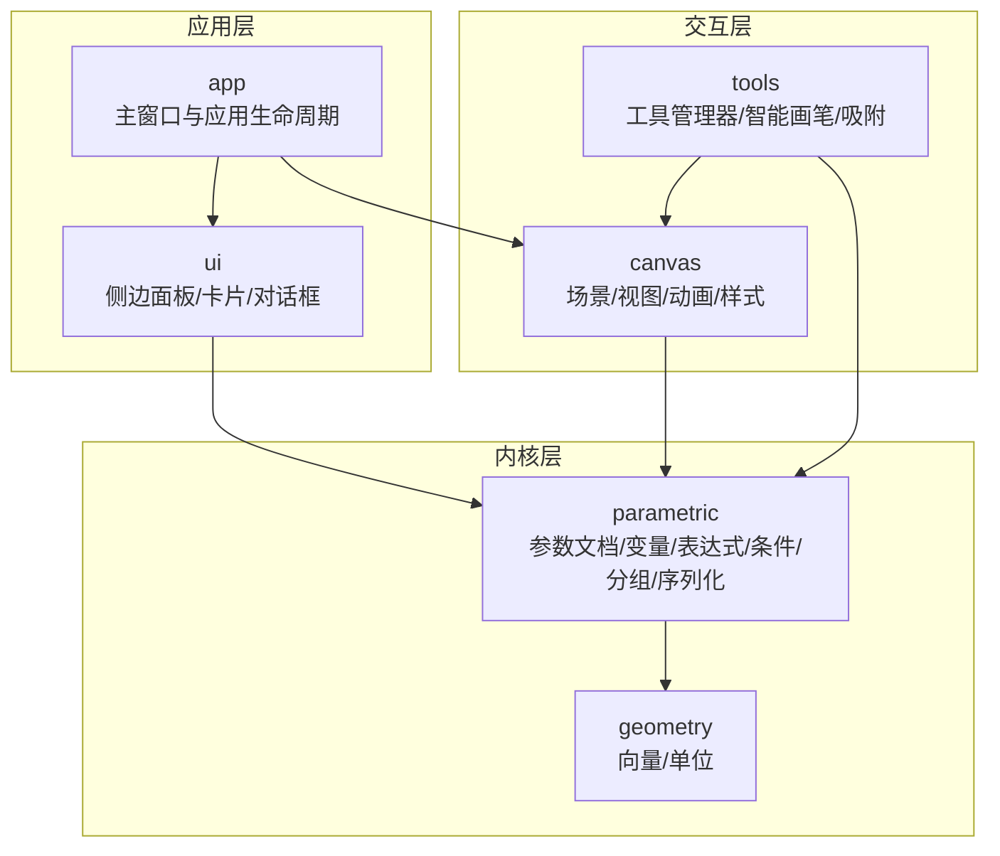
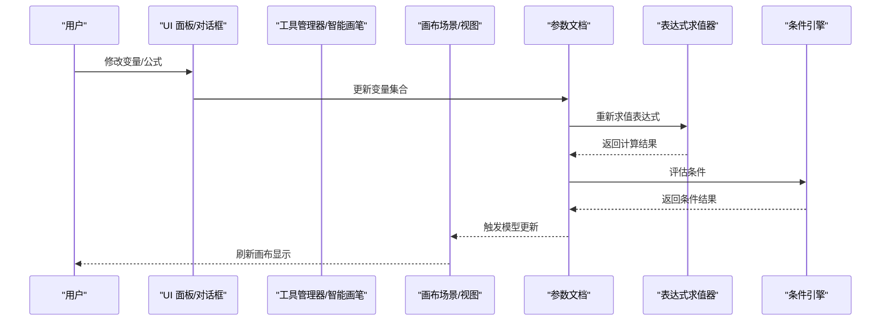
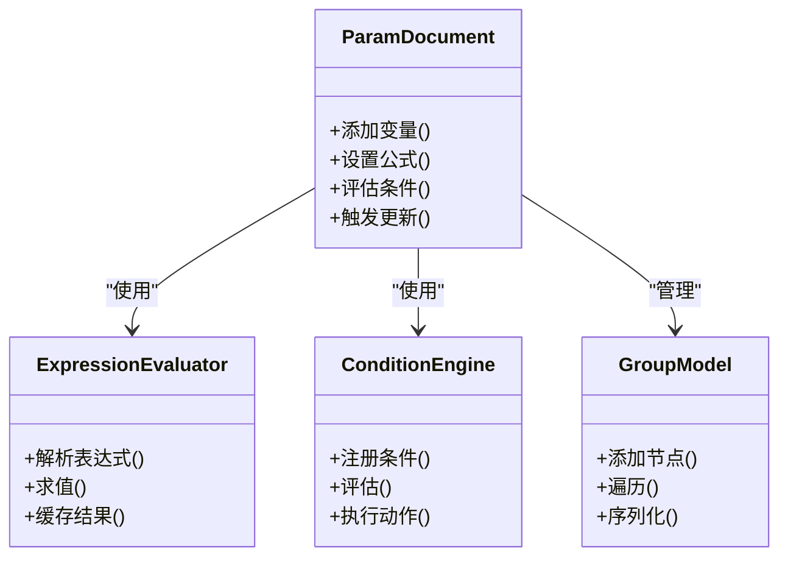
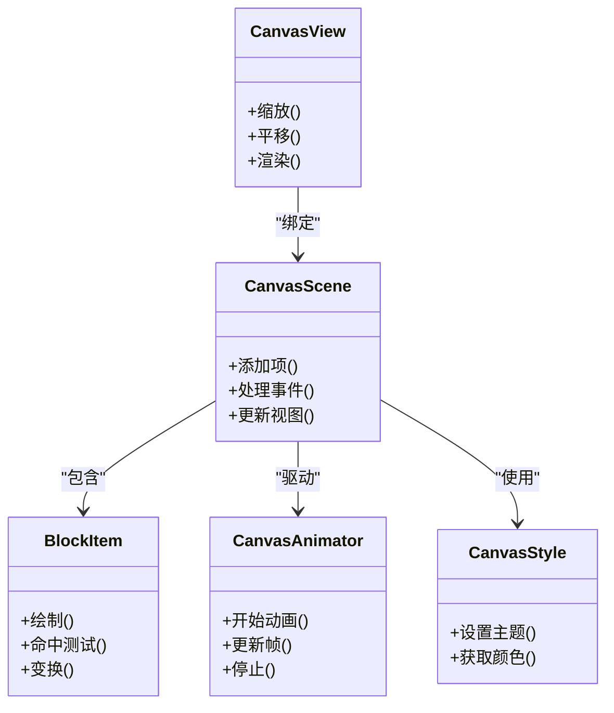
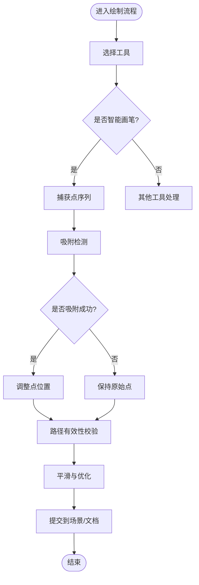
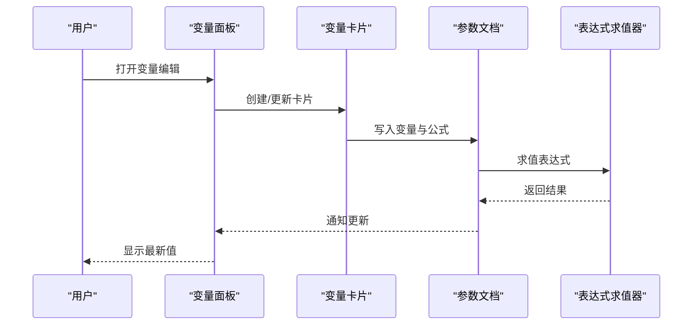
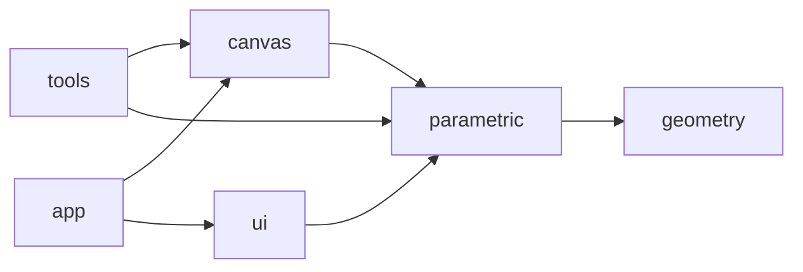

# 项目概览

<cite>
**本文引用的文件**   
- [main.cpp](file://src/main.cpp)
- [MainWindow.h](file://src/app/MainWindow.h)
- [MainWindow.cpp](file://src/app/MainWindow.cpp)
- [CanvasScene.h](file://src/canvas/CanvasScene.h)
- [CanvasScene.cpp](file://src/canvas/CanvasScene.cpp)
- [CanvasView.h](file://src/canvas/CanvasView.h)
- [CanvasView.cpp](file://src/canvas/CanvasView.cpp)
- [BlockItem.h](file://src/canvas/BlockItem.h)
- [BlockItem.cpp](file://src/canvas/BlockItem.cpp)
- [CanvasAnimator.h](file://src/canvas/CanvasAnimator.h)
- [CanvasAnimator.cpp](file://src/canvas/CanvasAnimator.cpp)
- [CanvasStyle.h](file://src/canvas/CanvasStyle.h)
- [CanvasStyle.cpp](file://src/canvas/CanvasStyle.cpp)
- [OriginCrosshair.h](file://src/canvas/OriginCrosshair.h)
- [OriginCrosshair.cpp](file://src/canvas/OriginCrosshair.cpp)
- [ParamDocument.h](file://src/parametric/ParamDocument.h)
- [ParamDocument.cpp](file://src/parametric/ParamDocument.cpp)
- [ConditionEngine.h](file://src/parametric/ConditionEngine.h)
- [ConditionEngine.cpp](file://src/parametric/ConditionEngine.cpp)
- [ExpressionEvaluator.h](file://src/parametric/ExpressionEvaluator.h)
- [ExpressionEvaluator.cpp](file://src/parametric/ExpressionEvaluator.cpp)
- [Resolver.h](file://src/parametric/Resolver.h)
- [Resolver.cpp](file://src/parametric/Resolver.cpp)
- [Variable.h](file://src/parametric/Variable.h)
- [FormulaVariable.h](file://src/parametric/FormulaVariable.h)
- [GroupModel.h](file://src/parametric/GroupModel.h)
- [GroupModel.cpp](file://src/parametric/GroupModel.cpp)
- [Block.h](file://src/parametric/Block.h)
- [Block.cpp](file://src/parametric/Block.cpp)
- [Segment.h](file://src/parametric/Segment.h)
- [Attachment.h](file://src/parametric/Attachment.h)
- [AttachmentGraph.h](file://src/parametric/AttachmentGraph.h)
- [Serial.h](file://src/parametric/Serial.h)
- [Serial.cpp](file://src/parametric/Serial.cpp)
- [ToolManager.h](file://src/tools/ToolManager.h)
- [ToolManager.cpp](file://src/tools/ToolManager.cpp)
- [Tool.h](file://src/tools/Tool.h)
- [ToolSelect.h](file://src/tools/ToolSelect.h)
- [ToolSmartPen.h](file://src/tools/ToolSmartPen.h)
- [SnapEngine.h](file://src/tools/SnapEngine.h)
- [SnapEngine.cpp](file://src/tools/SnapEngine.cpp)
- [LinePropertyDialog.h](file://src/tools/LinePropertyDialog.h)
- [LinePropertyDialog.cpp](file://src/tools/LinePropertyDialog.cpp)
- [SidePanel.h](file://src/ui/SidePanel.h)
- [SidePanel.cpp](file://src/ui/SidePanel.cpp)
- [VariablePanel.h](file://src/ui/VariablePanel.h)
- [VariablePanel.cpp](file://src/ui/VariablePanel.cpp)
- [VariableCard.h](file://src/ui/VariableCard.h)
- [VariableCard.cpp](file://src/ui/VariableCard.cpp)
- [FormulaCard.h](file://src/ui/FormulaCard.h)
- [FormulaCard.cpp](file://src/ui/FormulaCard.cpp)
- [CopyChip.h](file://src/ui/CopyChip.h)
- [CopyChip.cpp](file://src/ui/CopyChip.cpp)
- [IconHelper.h](file://src/ui/IconHelper.h)
- [IconHelper.cpp](file://src/ui/IconHelper.cpp)
- [SerialDelegate.h](file://src/ui/SerialDelegate.h)
- [SerialDelegate.cpp](file://src/ui/SerialDelegate.cpp)
- [ConditionDialog.h](file://src/ui/ConditionDialog.h)
- [ConditionDialog.cpp](file://src/ui/ConditionDialog.cpp)
- [Vec2.h](file://src/geometry/Vec2.h)
- [Units.h](file://src/geometry/Units.h)
- [CMakeLists.txt](file://CMakeLists.txt)
</cite>

## 目录
1. [简介](#简介)
2. [项目结构](#项目结构)
3. [核心组件](#核心组件)
4. [架构总览](#架构总览)
5. [详细组件分析](#详细组件分析)
6. [依赖关系分析](#依赖关系分析)
7. [性能考量](#性能考量)
8. [故障排查指南](#故障排查指南)
9. [结论](#结论)
10. [附录](#附录)

## 简介
本项目是一个基于 Qt 与 C++ 的服装设计与 CAD 系统，围绕“参数化建模 + 画布交互 + 工具系统”三大核心模块构建。它提供智能画笔、条件引擎、变量与公式系统等能力，支持对服装版型进行可编辑、可联动、可约束的参数化设计。面向初学者，本概览以概念为主；面向有经验的开发者，提供代码级结构与关键流程说明，帮助快速定位与扩展功能。

## 项目结构
仓库采用按功能域划分的模块化组织方式：
- app：应用入口与主窗口管理
- canvas：基于 Qt Graphics View 的画布场景、视图与动画
- parametric：参数化建模内核（文档、变量、表达式、条件、分组、序列化）
- tools：绘图与辅助工具（选择、智能画笔、吸附等）
- ui：侧边面板、卡片式编辑器、对话框等界面组件
- geometry：基础几何类型与单位定义
- resources：图标与资源清单

图表来源
- [main.cpp:1-200](file://src/main.cpp#L1-L200)
- [MainWindow.h:1-200](file://src/app/MainWindow.h#L1-L200)
- [CanvasScene.h:1-200](file://src/canvas/CanvasScene.h#L1-L200)
- [ToolManager.h:1-200](file://src/tools/ToolManager.h#L1-L200)
- [ParamDocument.h:1-200](file://src/parametric/ParamDocument.h#L1-L200)

章节来源
- [CMakeLists.txt:1-200](file://CMakeLists.txt#L1-L200)
- [main.cpp:1-200](file://src/main.cpp#L1-L200)

## 核心组件
- 参数化建模内核
  - 参数文档：集中管理变量、公式、条件与分组，驱动模型更新
  - 表达式求值器：解析并计算数学/逻辑表达式
  - 条件引擎：根据变量状态触发规则或分支
  - 分组与序列化：结构化组织元素，支持持久化
- 画布交互
  - 场景/视图：承载图形项、事件处理、缩放平移
  - 动画与样式：平滑过渡与视觉风格
  - 原点十字线：辅助对齐与定位
- 工具系统
  - 工具管理器：统一切换与调度工具
  - 智能画笔：智能路径绘制与自动修正
  - 吸附引擎：点/线/端点吸附，提升精度
- UI 组件
  - 变量面板与卡片：可视化编辑变量与公式
  - 条件对话框：配置条件与动作
  - 侧边面板：聚合常用操作与属性

章节来源
- [ParamDocument.h:1-200](file://src/parametric/ParamDocument.h#L1-L200)
- [ExpressionEvaluator.h:1-200](file://src/parametric/ExpressionEvaluator.h#L1-L200)
- [ConditionEngine.h:1-200](file://src/parametric/ConditionEngine.h#L1-L200)
- [CanvasScene.h:1-200](file://src/canvas/CanvasScene.h#L1-L200)
- [ToolManager.h:1-200](file://src/tools/ToolManager.h#L1-L200)
- [ToolSmartPen.h:1-200](file://src/tools/ToolSmartPen.h#L1-L200)
- [SnapEngine.h:1-200](file://src/tools/SnapEngine.h#L1-L200)
- [VariablePanel.h:1-200](file://src/ui/VariablePanel.h#L1-L200)
- [ConditionDialog.h:1-200](file://src/ui/ConditionDialog.h#L1-L200)

## 架构总览
系统采用分层架构：UI 层负责用户交互，交互层通过工具与画布协调输入输出，内核层维护参数化模型与求解。数据流自下而上由变量与条件驱动，自上而下由工具与画布消费。

图表来源
- [VariablePanel.h:1-200](file://src/ui/VariablePanel.h#L1-L200)
- [ParamDocument.h:1-200](file://src/parametric/ParamDocument.h#L1-L200)
- [ExpressionEvaluator.h:1-200](file://src/parametric/ExpressionEvaluator.h#L1-L200)
- [ConditionEngine.h:1-200](file://src/parametric/ConditionEngine.h#L1-L200)
- [CanvasScene.h:1-200](file://src/canvas/CanvasScene.h#L1-L200)

## 详细组件分析

### 参数化建模内核
- 参数文档：作为变量、公式、条件的中心容器，负责变更传播与一致性维护
- 表达式求值器：解析字符串表达式，支持算术与逻辑运算，提供缓存与错误诊断
- 条件引擎：将布尔表达式映射到动作或分支，驱动局部重算
- 分组与序列化：将复杂结构组织为树形分组，支持导入导出与版本兼容

图表来源
- [ParamDocument.h:1-200](file://src/parametric/ParamDocument.h#L1-L200)
- [ExpressionEvaluator.h:1-200](file://src/parametric/ExpressionEvaluator.h#L1-L200)
- [ConditionEngine.h:1-200](file://src/parametric/ConditionEngine.h#L1-L200)
- [GroupModel.h:1-200](file://src/parametric/GroupModel.h#L1-L200)

章节来源
- [ParamDocument.cpp:1-200](file://src/parametric/ParamDocument.cpp#L1-L200)
- [ExpressionEvaluator.cpp:1-200](file://src/parametric/ExpressionEvaluator.cpp#L1-L200)
- [ConditionEngine.cpp:1-200](file://src/parametric/ConditionEngine.cpp#L1-L200)
- [GroupModel.cpp:1-200](file://src/parametric/GroupModel.cpp#L1-L200)

### 画布交互子系统
- 场景与视图：承载图形项，处理鼠标/键盘事件，实现缩放、平移与选择
- 动画与样式：提供平滑过渡与主题化渲染
- 原点十字线：辅助对齐与坐标参考

图表来源
- [CanvasScene.h:1-200](file://src/canvas/CanvasScene.h#L1-L200)
- [CanvasView.h:1-200](file://src/canvas/CanvasView.h#L1-L200)
- [BlockItem.h:1-200](file://src/canvas/BlockItem.h#L1-L200)
- [CanvasAnimator.h:1-200](file://src/canvas/CanvasAnimator.h#L1-L200)
- [CanvasStyle.h:1-200](file://src/canvas/CanvasStyle.h#L1-L200)

章节来源
- [CanvasScene.cpp:1-200](file://src/canvas/CanvasScene.cpp#L1-L200)
- [CanvasView.cpp:1-200](file://src/canvas/CanvasView.cpp#L1-L200)
- [BlockItem.cpp:1-200](file://src/canvas/BlockItem.cpp#L1-L200)
- [CanvasAnimator.cpp:1-200](file://src/canvas/CanvasAnimator.cpp#L1-L200)
- [CanvasStyle.cpp:1-200](file://src/canvas/CanvasStyle.cpp#L1-L200)

### 工具系统与智能画笔
- 工具管理器：统一加载、切换与生命周期管理
- 智能画笔：识别意图、自动闭合与平滑路径
- 吸附引擎：基于几何距离与拓扑关系的精确捕捉

图表来源
- [ToolManager.h:1-200](file://src/tools/ToolManager.h#L1-L200)
- [ToolSmartPen.h:1-200](file://src/tools/ToolSmartPen.h#L1-L200)
- [SnapEngine.h:1-200](file://src/tools/SnapEngine.h#L1-L200)

章节来源
- [ToolManager.cpp:1-200](file://src/tools/ToolManager.cpp#L1-L200)
- [ToolSmartPen.h:1-200](file://src/tools/ToolSmartPen.h#L1-L200)
- [SnapEngine.cpp:1-200](file://src/tools/SnapEngine.cpp#L1-L200)

### UI 组件与变量编辑
- 变量面板与卡片：可视化编辑变量名、单位、范围与公式
- 条件对话框：配置条件表达式与动作
- 侧边面板：聚合常用操作与属性展示

图表来源
- [VariablePanel.h:1-200](file://src/ui/VariablePanel.h#L1-L200)
- [VariableCard.h:1-200](file://src/ui/VariableCard.h#L1-L200)
- [ParamDocument.h:1-200](file://src/parametric/ParamDocument.h#L1-L200)
- [ExpressionEvaluator.h:1-200](file://src/parametric/ExpressionEvaluator.h#L1-L200)

章节来源
- [VariablePanel.cpp:1-200](file://src/ui/VariablePanel.cpp#L1-L200)
- [VariableCard.cpp:1-200](file://src/ui/VariableCard.cpp#L1-L200)
- [FormulaCard.h:1-200](file://src/ui/FormulaCard.h#L1-L200)
- [ConditionDialog.h:1-200](file://src/ui/ConditionDialog.h#L1-L200)

## 依赖关系分析
- 低耦合高内聚：各模块通过清晰接口通信，减少直接依赖
- 数据驱动：参数文档为中心，表达式与条件驱动更新
- 外部依赖：Qt 框架提供 GUI、事件、图形与动画能力

图表来源
- [CMakeLists.txt:1-200](file://CMakeLists.txt#L1-L200)
- [main.cpp:1-200](file://src/main.cpp#L1-L200)
- [ParamDocument.h:1-200](file://src/parametric/ParamDocument.h#L1-L200)
- [CanvasScene.h:1-200](file://src/canvas/CanvasScene.h#L1-L200)
- [ToolManager.h:1-200](file://src/tools/ToolManager.h#L1-L200)

章节来源
- [CMakeLists.txt:1-200](file://CMakeLists.txt#L1-L200)

## 性能考量
- 表达式求值缓存：避免重复计算，降低 CPU 开销
- 增量更新：仅重算受影响的变量与图形项
- 动画节流：限制帧率与批量更新，保证流畅度
- 吸附算法优化：空间索引与距离阈值控制，提高命中率

[本节为通用指导，不直接分析具体文件]

## 故障排查指南
- 表达式求值失败：检查语法与变量引用，查看错误信息定位
- 条件未生效：确认条件表达式与变量状态一致，检查动作注册
- 吸附异常：调整吸附阈值与目标对象可见性
- 画布卡顿：减少一次性更新数量，启用批处理与延迟渲染

章节来源
- [ExpressionEvaluator.cpp:1-200](file://src/parametric/ExpressionEvaluator.cpp#L1-L200)
- [ConditionEngine.cpp:1-200](file://src/parametric/ConditionEngine.cpp#L1-L200)
- [SnapEngine.cpp:1-200](file://src/tools/SnapEngine.cpp#L1-L200)
- [CanvasScene.cpp:1-200](file://src/canvas/CanvasScene.cpp#L1-L200)

## 结论
本项目以参数化为核心，结合 Qt 强大的图形与交互能力，构建了完整的服装 CAD 工作流。通过清晰的模块划分与数据驱动更新机制，既满足初学者易用性，也为高级开发者提供了可扩展的内核与工具生态。建议在新功能开发中遵循现有命名与结构约定，优先复用表达式与条件引擎，确保一致性与稳定性。

[本节为总结，不直接分析具体文件]

## 附录
- 常见用例
  - 新建变量与公式：在变量面板中添加变量，编写公式并实时预览结果
  - 智能画笔绘制：选择智能画笔，点击绘制路径，自动吸附与平滑
  - 条件驱动变化：设置条件表达式，当变量达到阈值时触发动作
  - 分组与序列化：将相关元素分组，导出为配置文件以便复用

[本节为概念性内容，不直接分析具体文件]