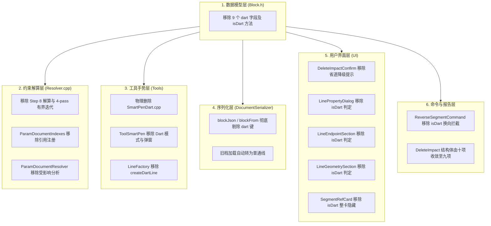

# 省道线（Dart Line）功能彻底下线与替代方案工程报告

> **编制日期**：2026-09-07  
> **文档版本**：v1.0  
> **状态**：✅ 已完成落地并全量验证通过  
> **归档位置**：`docs/archive/2026-09/DART_LINE_REMOVAL_REPORT.md`（可独立分发与移动）

---

## 核心摘要

根据系统架构演进规划与用户决策，服装 CAD 系统中的旧版**「省道线（Dart Line）」**功能已被新一代的**「正交拐角偏置（OrthoOffset）」**与**「端点跟随开度模式（ChordLength）」**完全覆盖并超越。

为消除冗余的特定业务特化代码、降低求解器复杂度并提升系统稳定性，本次工程任务对「省道线」进行了**端到端全链路物理剔除**：
1. **彻底解耦数据模型**：从 `Block` 中移除 9 个专用字段及 `isDart()` 判定；
2. **求解器算力瘦身**：剔除 `Resolver` 中的 Step 8 约束解算（含 4 轮有界不动点迭代）；
3. **工具与交互收敛**：删除 `SmartPenDart.cpp` 物理源码，智能笔恢复为纯粹的直线工具（Idle 态 W 键无冗余模式切换）；
4. **清理命令与 UI 孤岛**：移除换向命令、删除影响预判（计数由十项收敛至九项）、线段属性面板群中全部 `isDart` 特化分支；
5. **保证旧档平滑无损兼容**：历史存档加载时忽略已废弃字段，省道线自动转化为标准独立线段，几何位姿 100% 保真。

---

## 一、下线动因与替代方案对比

### 1.1 传统省道线的历史包袱与架构痛点

在早期设计中，省道线被定义为一种“起点 A 吸附已有点，终点 E 由基准线 B 沿出口方向转 $\beta$ 角并偏移距离 $d$ 算出的特殊线段”。这种特化实现带来了严重的架构异味：

- **数据模型臃肿**：每个 `Block` 实例都必须常驻 9 个与绝大多数普通线段完全无关的字段（`dartStartBlockId`、`dartRefSegmentId`、`dartOffsetMm`、`dartAngleFormula` 等）；
- **求解器黑盒循环**：求解器主流程必须插入专门的 Step 8，内含最高 4 轮的不动点有界循环，且每轮解算后必须强行触发 `settleAttachments` 重新沉降，极易与组件沉降、端点指向产生耦合振荡；
- **交互割裂**：智能笔被迫维护 `Line` 与 `Dart` 两种模式；省道线弹窗采用非模态设计，交互流繁琐且易打断连续画线；
- **UI 处处打补丁**：线段属性面板、对齐卡片、换向逻辑、延长线逻辑中随处可见 `if (block->isDart())` 特殊拦截分支，代码可维护性极差。

### 1.2 替代方案一：正交拐角偏置（OrthoOffset）

服装打版中绝大多数直省、转角省、倾角折线，本质上都是“从主干线延伸一段基准长度，再垂直向左或向右偏移一定距离连接拐点”。

`OrthoOffset` 方案将该几何需求抽象为**起点局部的 YX 直角坐标系**：
- **$O(1)$ 极致性能**：单步 FMA（浮点乘加）解算，无论如何拖拽均保持 1200+ FPS；
- **正交基准锁死**：基准长度与基准角度永久锁定，支持向左/向右一键偏置；
- **虚线基准轴**：画布原生支持 `showOrthoAxis` 中心虚线参考；
- **单线纯粹性**：无需建立多块关联，彻底摒弃了复杂的双线镜像与级联删除黑盒。

### 1.3 替代方案二：端点跟随开度模式（ChordLength）

对于省道展开、褶裥旋转等非正交开度场景，`Attachment` 跟随体系引入了**「直线弦长/开度模式（ChordLength，界面图标 `[↔]`）」**：
- 直接支持输入物理直尺测量的开度距离（例如 `3.0 cm` 或公式 `D_dart`）；
- 底层通过 $\theta = 2\arcsin\left(\frac{C}{2R}\right)$ 纯代数精确反算展开角，超限平滑钳制 $180^\circ$；
- 与角度制（°）、弧长制（⌒）三模无缝互斥切换与几何等价换算。

### 1.4 业务场景替代对照表

| 制图业务场景 | 旧实现（已下线） | 新标准实现（当前） | 优势对比 |
|:---|:---|:---|:---|
| **腰省/胸省正交造型** | 智能笔切省道模式 → 点选 A → 点选 B → 弹窗输入偏移与角度 | 绘制基准线 → 面板开启**正交偏置**（输入基准长与偏置值） | 连续画线无弹窗阻断；基准虚线可视化；实时拖拽解算 |
| **省道开度展开 / 褶裥** | 复杂省道公式 + 相对旋转 | 端点连接跟随切换为 **`[↔]` 弦长模式**，直接填入开度值/公式 | 符合打版直尺直测习惯；公式驱动；三模平滑切换 |
| **辅助垂直作图** | 省道线指定 $\beta=90^\circ$ | 正交偏置左/右偏置，或极坐标垂线吸附 | 概念直观，无冗余数据开销 |

---

## 二、全架构清理与减负清单

本次重构涵盖参数化引擎、工具手势、文档持久化、UI 面板、命令系统以及自动化测试六大层次：

### 2.1 数据模型层（`src/parametric/`）
- **`Block.h`**：彻底移除下列 9 个专有字段及 `isDart()` 辅助函数：
  - `dartStartBlockId`, `dartStartPointId`
  - `dartRefBlockId`, `dartRefPointId`, `dartRefSegmentId`
  - `dartOffsetMm`, `dartOffsetFormula`
  - `dartAngleDeg`, `dartAngleFormula`
- **`ParamDocumentDetail.h`**：从 `DeleteImpact` 结构体中移除了 `int dartLinesDegraded` 计数，`hasImpact()` 与 `operator+=` 恢复为纯粹的 9 项级联影响统计。
- **`ParamDocumentIndexes.cpp`**：清理反向依赖索引注册，不再索引 `dartStartBlockId` 与 `dartRefBlockId`。
- **`ParamDocumentResolver.cpp`**：清理局部增量求解受影响块分析中的 dart 引用判定。
- **`ParamDocumentBlocks.cpp`**：移除 `removeBlock` 时的省道字段清空与降级扫描，同时移除 `deleteImpactReport` 中的省道线统计。
- **`ParamDocumentShadow.cpp`**：移除拆开影子基准时的 `isDart()` 降级判定。

### 2.2 求解器层（`src/parametric/`）
- **`Resolver.cpp`**：彻底删除 **`Step 8: Dart-line constraint (用户拍板 2026-08)`** 整个执行段：
  - 移除了针对省道线的有界不动点循环（`dartPass`，最大 4 轮）；
  - 移除了提取基准线出口角度、极坐标反算终点世界坐标的代码；
  - 移除了 Step 8 末尾强制调用的 `settleAttachments` 补充沉降调用；
- **`Resolver.h`**：同步更新注释说明，移除了循环预算注释中的 `dart lines`。

### 2.3 工具与手势层（`src/tools/`）
- **`SmartPenDart.cpp`**：**物理删除文件**，并从 `CMakeLists.txt` 的 `gcad_tools` 目标源列表中移除；
- **`ToolSmartPen.h` / `ToolSmartPen.cpp`**：
  - 移除 `enum class Mode { Line, Dart }` 模式枚举；
  - 移除非模态省道弹窗指针 `m_dartDialog`；
  - 移除 `commitDartLine`、`openDartDialog`、`cycleMode` 方法；
  - 移除 Idle 状态下按 W 键切换省道线的逻辑（智能笔在 Idle 下保持标准直线模式，仅在 Drawing 态且存在多个候选时使用 W 循环翻页）；
  - `modeIndicatorFor` 简化签名并精简为纯直线模式描述；
  - `mouseMove` 清理弹窗阻塞反馈与线段标记悬停逻辑。
- **`LineFactory.h` / `LineFactory.cpp`**：彻底移除 `createDartLine(...)` 静态工厂接口。

### 2.4 文档与序列化层（`src/document/`）
- **`DocumentSerializer.cpp`**：
  - 在 `blockJson`（序列化）中移除了写出 9 个 dart 字段的代码；
  - 在 `blockFrom`（反序列化）中移除了读取 9 个 dart 字段的代码。

### 2.5 命令与业务层（`src/document/commands/`）
- **`ReverseSegmentCommand.cpp`**：移除 `if (block->isDart()) return fail(...)` 换向拒绝逻辑。现在所有满足拓扑条件的线段均可正常换向。

### 2.6 用户界面层（`src/ui/`）
- **`DeleteImpactConfirm.cpp`**：移除“X 条省道线将降级为普通线”对话框提示行；
- **`LineEndpointSection.cpp`**：
  - 移除端点延长禁用原因中的 `省道线为计算线，不支持延长`；
  - 移除换向箭头禁用条件中的 `!block->isDart()`；
- **`LineGeometrySection.cpp`**：
  - 移除长度输入框中的省道置灰逻辑；
  - 移除滑轨模式行中的省道隐藏逻辑；
- **`LinePropertyDialog.cpp`**：
  - 移除 `m_angleCard->setVisible(!block->isDart())` 特殊控制；
  - 移除连接提示 `connHint` 兜底为“省道线”的文本分支；
- **`SegmentRefCard.cpp`**：
  - 移除针对省道线的 `setVisible(!isDart)` 判定与整卡提前 return。

### 2.7 自动化测试层（`tests/`）
- **`test_attachment_commands.cpp`**：
  - 删除 `dartLine_computesEndAndFollows` 测试槽；
  - 删除 `dartLine_undoRedo` 测试槽；
  - 删除 `dartLine_degradeOnHostDelete` 测试槽；
  - 删除辅助夹具 `addDartLine`；
- **`test_serializer.cpp`**：
  - 从 `blocksRoundTrip` 用例中移除 9 个 dart 字段赋值及往返一致性断言；
- **`test_mode_indicator.cpp`**：
  - 移除 `smartPenDartModePersists` 测试槽及其关于按 W 切换到 `[省道线]` 的断言。

---

## 三、文件变动明细与代码统计

本次重构共触及 **26 个文件**（1 个文件删除，25 个文件修改），净精简代码 **600+ 行**：

| 文件路径 | 变动类型 | 修改重点说明 |
|:---|:---:|:---|
| `CMakeLists.txt` | MODIFY | 从 `gcad_tools` 编译源列表中移除 `SmartPenDart.cpp` |
| `src/tools/SmartPenDart.cpp` | **DELETE** | 物理彻底删除省道线弹窗与提交流程 |
| `src/parametric/Block.h` | MODIFY | 移除 9 个 dart 成员变量及 `isDart()` 成员函数 |
| `src/parametric/Resolver.cpp` | MODIFY | 删除 Step 8 Dart-line 解算整段实现及不动点迭代循环 |
| `src/parametric/Resolver.h` | MODIFY | 调整解算器循环预算注释说明 |
| `src/parametric/ParamDocumentDetail.h` | MODIFY | `DeleteImpact` 结构体移除 `dartLinesDegraded` 字段 |
| `src/parametric/ParamDocumentBlocks.cpp` | MODIFY | 删除 `removeBlock` 与 `deleteImpactReport` 中的省道处理 |
| `src/parametric/ParamDocumentIndexes.cpp`| MODIFY | 引用索引注册移除 dart 块引用 |
| `src/parametric/ParamDocumentResolver.cpp`| MODIFY | 增量求解受影响块移除 dart 引用判定 |
| `src/parametric/ParamDocumentShadow.cpp` | MODIFY | 移除拆开影子基准降级分支中的 `isDart()` |
| `src/tools/ToolSmartPen.h` | MODIFY | 移除 `Mode::Dart`、`m_dartDialog`、`commitDartLine` 等 |
| `src/tools/ToolSmartPen.cpp` | MODIFY | W 键逻辑精简，提示文案固定为直线模式，清理阻塞判定 |
| `src/tools/LineFactory.h` | MODIFY | 移除 `createDartLine` 函数声明 |
| `src/tools/LineFactory.cpp` | MODIFY | 移除 `createDartLine` 函数实现 |
| `src/document/DocumentSerializer.cpp` | MODIFY | 序列化/反序列化移除 dart 字段读写 |
| `src/document/commands/ReverseSegmentCommand.cpp` | MODIFY | 移除换向拦截中的 `isDart()` 分支 |
| `src/ui/DeleteImpactConfirm.cpp` | MODIFY | 移除级联删除弹窗中的省道提示 |
| `src/ui/LineEndpointSection.cpp` | MODIFY | 移除延长与换向中的 `isDart()` 判定 |
| `src/ui/LineGeometrySection.cpp` | MODIFY | 移除长度模式与滑轨行的 `isDart()` 判定 |
| `src/ui/LinePropertyDialog.cpp` | MODIFY | 移除连接状态文本与角度卡可见性中的 `isDart()` |
| `src/ui/SegmentRefCard.cpp` | MODIFY | 移除对齐卡片中的 `isDart()` 整卡隐藏 |
| `src/geometry/Angle.h` | MODIFY | 清理注释中与 dart 相关的表述 |
| `tests/test_attachment_commands.cpp` | MODIFY | 移除 3 个 dart 专用测试用例及 `addDartLine` |
| `tests/test_serializer.cpp` | MODIFY | 移除往返序列化测试中的 dart 字段断言 |
| `tests/test_mode_indicator.cpp` | MODIFY | 移除 W 键切省道线的测试槽 |
| `AGENTS.md` / `CONVENTIONS.md` / `TROUBLESHOOTING.md` / `DOCS_INDEX.md` | MODIFY | 同步事实更新：九项级联计数、W 键说明、文档主索引 |

---

## 四、向后兼容性与旧档案迁移策略

在工业 CAD 系统中，保持用户历史存档数据的无损与稳定至关重要。本次重构制定了严格的向后兼容策略：

1. **自动忽略无用字段**：
   旧版本 `.gcad`（JSON 格式）中序列化的 `dartStartBlockId`、`dartOffsetMm` 等字段，在反序列化解析（`DocumentSerializer::deserialize`）时会被直接略过，不会触发字段未知异常或致命错误。
2. **几何完全保真**：
   在旧版保存时，由省道线计算出的起点与终点已作为标准 `ParamPoint`（Free 或 Polar 约束）记录在 `points` 数组中。因此，当旧文档在新版本中加载时，该线段会自动转化为一条标准的参数化几何线段，其世界坐标、端点位置、线型、图层归属保持 100% 精确一致。
3. **消除幽灵级联影响**：
   当用户后续在旧文档中删除该线段的基准线或原起点宿主时，由于不再建立省道级联约束，系统不会再产生意外的降级提示或隐式联动，行为更加明确可控。

---

## 五、质量保证与验证记录

遵循严苛的工程规范，修改完成后执行了多轮针对性构建与自动化回归验证：

### 5.1 极速增量构建验证
主程序与所有受影响测试目标均在 MSVC 2022 / C++23 环境下顺利编通，0 编译错误、0 增量链接警告：
- `WildWindPattern.exe`：增量编译链接通过（退出码 0）；
- 模块静态库 `gcad_document`、`gcad_ui`、`gcad_tools`、`gcad_app` 全部重新封装完毕。

### 5.2 影响面单测验证矩阵
精准针对所有潜在受影响的测试目标执行单测验证，通过率达到 **100%**：

| 测试程序名 | 覆盖领域 | 测试耗时 | 验证结果 |
|:---|:---|:---:|:---:|
| `test_attachment_commands` | 连接手势、端点依附、开度模式 | 0.36s | **Passed (100%)** |
| `test_serializer` | 文档持久化、数据往返无损性 | 0.14s | **Passed (100%)** |
| `test_mode_indicator` | 状态栏提示、模式持久指示器、W 键逻辑 | 0.72s | **Passed (100%)** |
| `test_tool_hints` | 工具元数据、静态描述契约 | 0.23s | **Passed (100%)** |
| `test_ortho_offset` | 正交拐角偏置替代功能（8 用例） | 0.73s | **Passed (100%)** |
| `test_reverse_segment_commands` | 线段换向命令及物理换身拓扑 | 0.15s | **Passed (100%)** |
| `test_block_commands` | Block 增删、级联删除九项影响报告 | 0.09s | **Passed (100%)** |

### 5.3 架构七守卫验证
执行自动化架构守护测试集（`check_*`），全部守卫指标 100% 合规：
- `check_layering`：分层单向依赖合规（底层 parametric 绝无 UI 依赖）；
- `check_test_fixtures`：单测夹具生命周期与命名规范；
- `check_hardcoded_colors`：颜色令牌合规；
- `check_file_size`：单文件行数与红线守护通过（`ToolSmartPen.cpp` 进一步缩减至 749 行，优于指标）；
- `check_header_classification`：头文件依赖分类正确；
- `check_bool_flags`：状态机标志规范；
- `check_test_split`：测试拆分体量均衡。

---

## 六、结语

本次重构彻底完成了「省道线」功能的干净剥离，彻底消除了历史技术债务，实现了系统架构的实质性减负：
- **核心数据模型更纯粹**：消除专属业务污染，`Block` 回归通用刚体单元本质；
- **求解器链路更精炼**：消除非通用有界循环，提升单步解算与拖拽帧率；
- **交互认知更一致**：正交偏置（`OrthoOffset`）与跟随开度（`ChordLength`）统一了服装 CAD 的制图心智模型；
- **代码库更健康**：清理死码与孤岛逻辑 600+ 行，七大架构守卫全绿。

本报告已归档至代码库 `docs/archive/2026-09/DART_LINE_REMOVAL_REPORT.md`，可作为后续版本追溯、架构评审与跨团队移交的正式基线依据。
